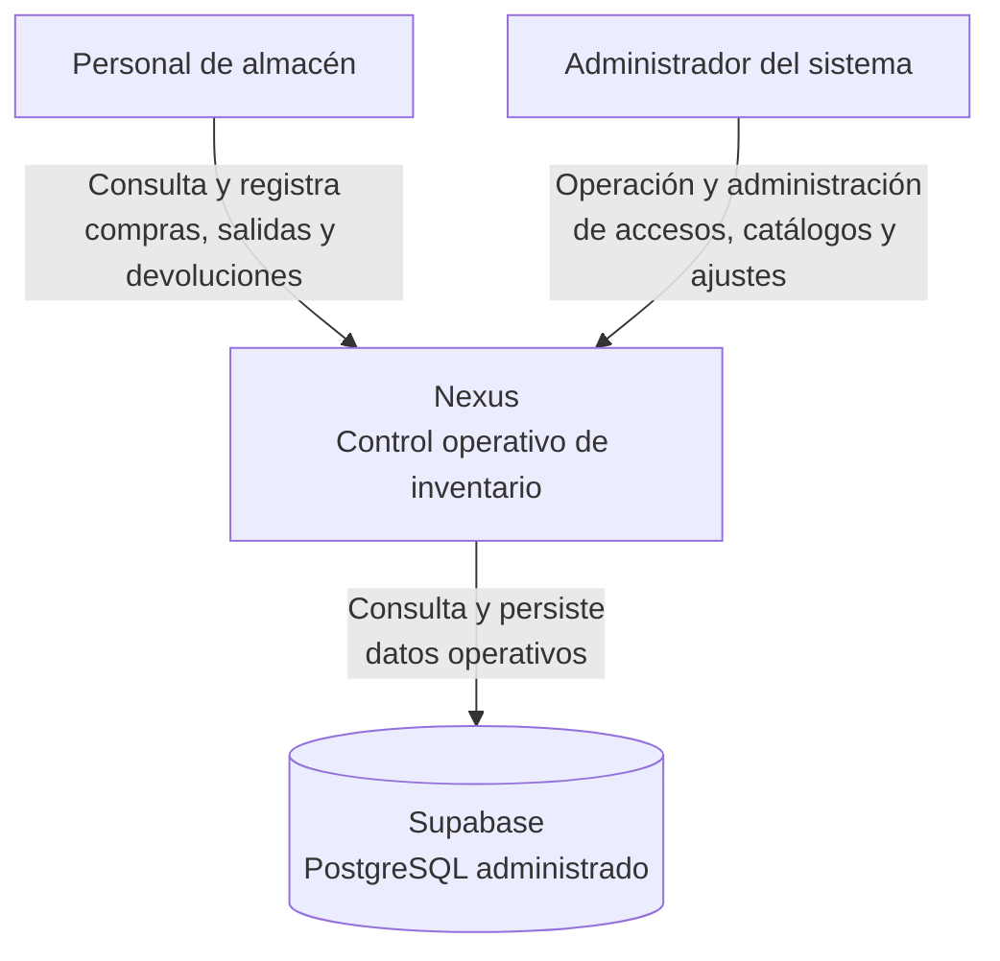
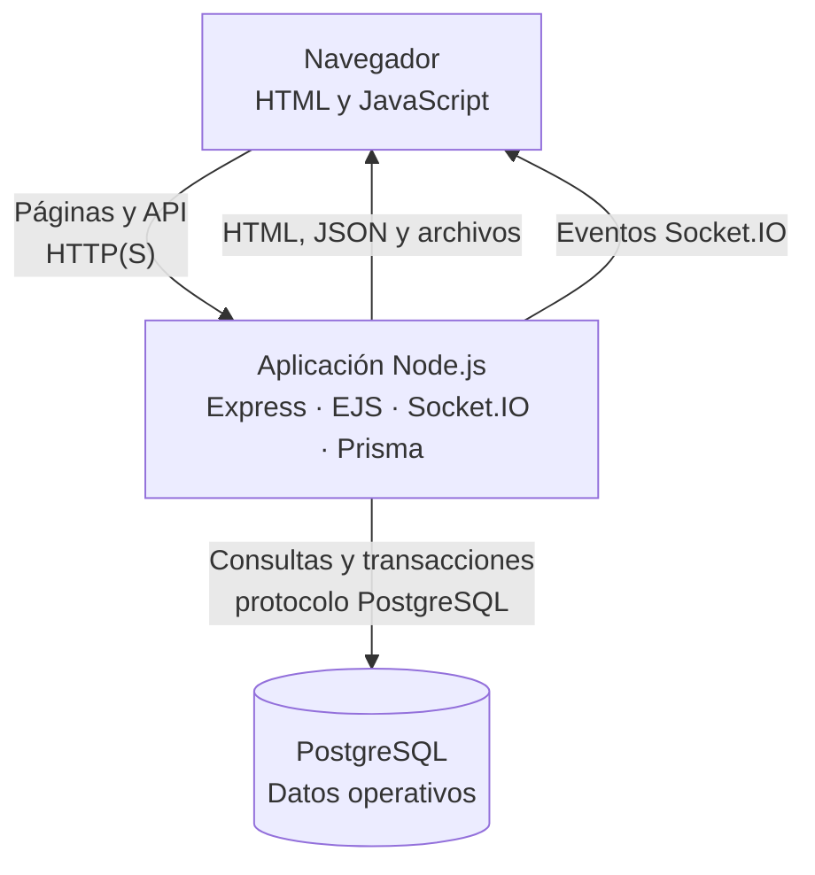
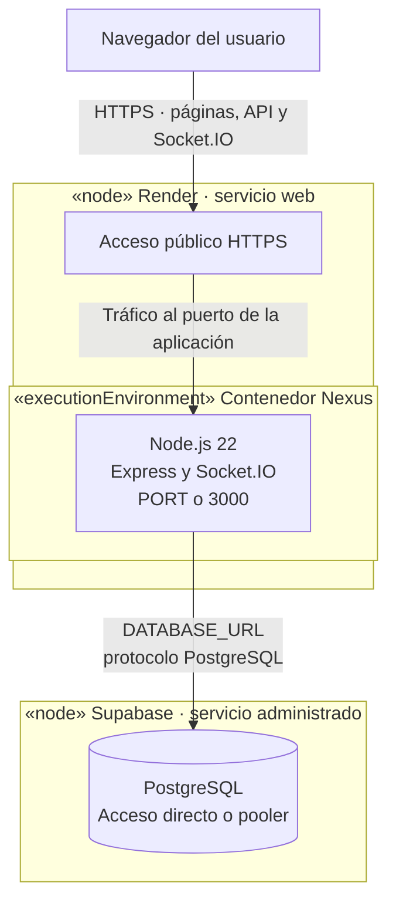
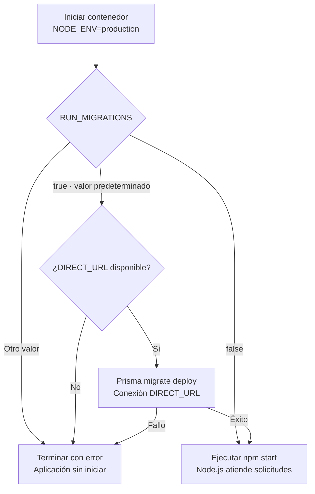
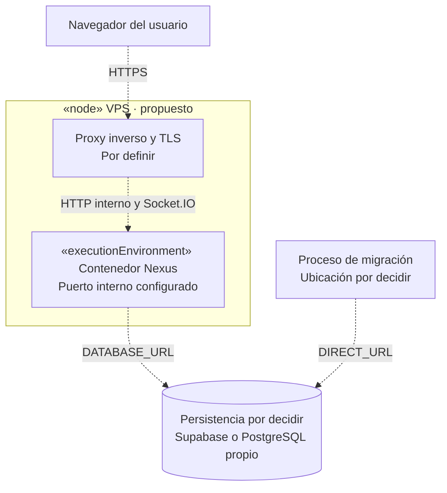

# 1. Distribución y despliegue de Nexus

## Alcance y fuentes

Esta vista explica dónde se ejecuta cada parte de Nexus, cómo se comunica y qué
necesita para arrancar. El contexto y los contenedores introducen los límites del
sistema; la topología de despliegue muestra su distribución en infraestructura.
Las capas de código se mantienen en la [vista lógica](../logical/01-components-and-reuse.md).

| Aspecto | Fuente | Qué permite afirmar |
| --- | --- | --- |
| Render y Supabase | Decisión operativa registrada en el `README.md` | Es la topología vigente documentada; el repositorio no verifica la configuración activa del proveedor. |
| Imagen de aplicación | `Dockerfile` | Node.js 22, generación de Prisma durante la construcción y ejecución con el usuario `node`. |
| Arranque del contenedor | `docker-entrypoint.sh` | Fuerza producción y, por defecto, aplica migraciones antes de iniciar la aplicación. |
| Servidor y puerto | `src/app.js` | Express y Socket.IO comparten un servidor HTTP que escucha en `0.0.0.0`, con `PORT` o 3000 por defecto. |
| Conexiones a PostgreSQL | `src/lib/prisma.js`, `src/lib/databaseUrl.js` y `prisma.config.ts` | La aplicación usa `DATABASE_URL`; el CLI prefiere `DIRECT_URL`. |
| Ejecución en un host | `docker-compose.yml` | Reproduce el contenedor de aplicación; no crea PostgreSQL ni configura Render. |

## Contexto del sistema

Las personas están fuera del límite de Nexus. Las flechas resumen interacciones de
negocio, sin representar permisos individuales, herencia entre actores ni pasos de
un caso de uso. Supabase aparece como dependencia externa de persistencia; Render
se incorpora después como alojamiento de la aplicación.

Estos son los dos actores con acceso vigente. La supervisión por coordinación y
dirección permanece como alcance pendiente en requisitos, sin un acceso adicional
implementado. ERP, CRM y transportistas tampoco son integraciones vigentes.

## Contenedores de ejecución

«Contenedor» identifica aquí una unidad que ejecuta o almacena información. Sólo la
aplicación se empaqueta como imagen Docker; el navegador y PostgreSQL son unidades
externas a esa imagen. Express, EJS, Socket.IO y Prisma colaboran en la misma
aplicación y no son servicios desplegados por separado.

| Unidad | Responsabilidad y límite |
| --- | --- |
| Navegador | Presenta el HTML recibido, ejecuta JavaScript, envía solicitudes y recibe avisos de actualización. No ejecuta EJS ni se conecta directamente a PostgreSQL. |
| Aplicación | Renderiza las plantillas EJS, autentica y autoriza las peticiones y ejecuta las reglas y transacciones mediante Prisma. Los controladores notifican cambios por Socket.IO después de completar la operación correspondiente. |
| Base de datos | Conserva documentos, detalles, existencias e historia. Las cuentas PostgreSQL son identidades de infraestructura, distintas de los usuarios y roles funcionales de Nexus. |

Socket.IO usa el mismo servidor que Express. Los avisos permiten actualizar los
listados; la consulta API sigue siendo la fuente de datos de la pantalla. La figura
no presupone un servicio de mensajería ni una segunda aplicación de tiempo real.

## Despliegue actual: Render y Supabase

Render publica el servicio web y aloja el contenedor de Nexus. Supabase administra
PostgreSQL. Las flechas de esta figura son canales de comunicación; el orden de
arranque se representa por separado. Las credenciales se suministran como variables
de entorno, sin mostrarlas en los diagramas.

`PORT` determina el puerto real; `EXPOSE 3000` declara el valor convencional de la
imagen y no configura por sí solo el enrutamiento de Render. HTTPS representa el
acceso público documentado. Las opciones de cifrado, pooler y red de la conexión a
PostgreSQL dependen de las URLs y de la configuración del proveedor, que debe
comprobarse en el entorno desplegado.

## Arranque y migraciones

El contenedor ejecuta `docker-entrypoint.sh` con `NODE_ENV=production`. Si
`RUN_MIGRATIONS` no se indica, adopta `true`. Migrar y atender solicitudes son fases
del mismo contenedor, no dos servicios permanentes.

La fase de migración conecta con la misma base objetivo mediante `DIRECT_URL`; la
fase de aplicación usa `DATABASE_URL`. Un fallo no inicia Node.js y debe revisarse
en los registros de despliegue. Desactivar las migraciones sólo omite esa fase:
no garantiza que el esquema ya sea compatible con la versión que se inicia.

Con la configuración predeterminada, el contenedor recibe ambas URLs. Separarlas
permite usar cuentas con distintos privilegios, pero no elimina la credencial de
migración del contenedor. Para aislarla se necesita un proceso de despliegue separado
que migre antes de arrancar la aplicación con `RUN_MIGRATIONS=false`; esa alternativa
y su aprovisionamiento se explican en el [capítulo de cuentas PostgreSQL](02-postgresql-runtime-and-migration-roles.md).

## Alternativa reproducible en un host

`docker-compose.yml` construye la imagen, carga `.env`, activa migraciones y publica
`3000:3000`. Declara el usuario `node`, el sistema de archivos de sólo lectura, un
espacio temporal en `/tmp` y restricciones de capacidades. Esas opciones pertenecen
a Compose; no se deben atribuir automáticamente al servicio administrado de Render.
Si se cambia el puerto interno, también debe revisarse el mapeo de Compose.

Este archivo no crea una base local, no termina TLS y no configura copias de
seguridad. La persistencia debe estar disponible mediante las URLs suministradas.

## Despliegue objetivo: aplicación en un VPS

El traslado de la aplicación a un VPS es una propuesta. Las líneas discontinuas
indican conexiones previstas; no evidencian infraestructura ya instalada. Se mantiene
separada la conexión de aplicación de la ruta que emplearía el proceso de migración.

| Decisión pendiente | Qué debe quedar definido antes del traslado |
| --- | --- |
| Publicación del servicio | Dominio, certificados, proxy inverso, puerto interno y soporte de Socket.IO. |
| Persistencia | Continuidad en Supabase o administración propia de PostgreSQL, conectividad y cifrado. |
| Despliegue y migraciones | Construcción de la imagen, suministro de secretos, orden de migración y arranque, y recuperación ante fallos. |
| Operación | Copias de seguridad y restauración comprobada, registros, monitoreo y recuperación del servicio. |

Las figuras de despliegue son aproximaciones con `flowchart` y estereotipos UML;
Mermaid no representa aquí conectores y puertos UML nativos. No especifican cantidad
de réplicas, alta disponibilidad, redes privadas ni un mecanismo de despliegue que
no esté documentado. Una configuración versionada o una verificación del proveedor
es necesaria para convertir la topología objetivo en vigente.
