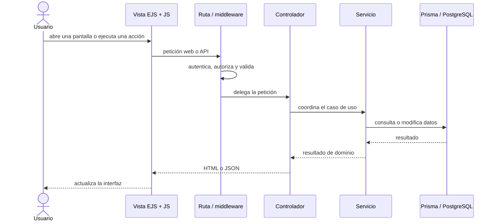

# 1. Recorrido extremo a extremo de una interacción

Esta secuencia complementa el
[diagrama de componentes](../logical/01-components-and-reuse.md#componentes-y-conexión-entre-frontend-y-backend):
aquí las flechas representan orden temporal, no dependencias estructurales. El contrato
de cada intercambio permanece en el contrato API y en OpenAPI.

