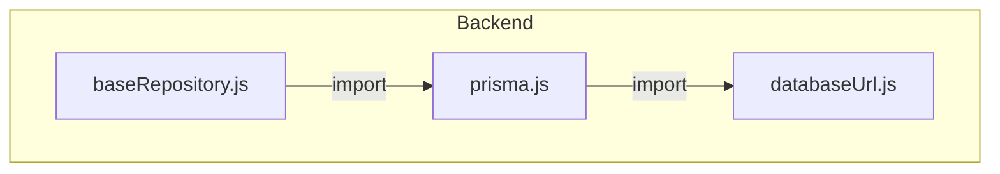
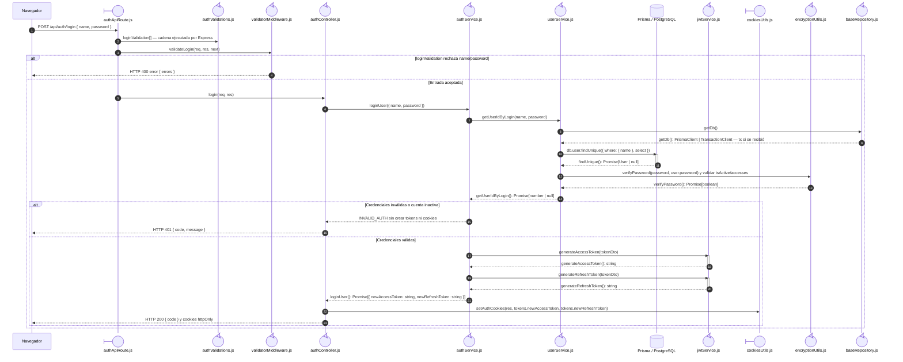

# `CU-AUT-01` — Iniciar sesión

**Patrones:** `BE-P01`, `BE-P08`.

## Participantes y trazabilidad

Cada línea de vida técnica corresponde a un único archivo de implementación, indicado
por su alias en la tabla. Dos archivos distintos usan participantes distintos. Los actores,
el navegador y la frontera de persistencia son elementos externos, no archivos del proyecto.
Los retornos representan el resultado o error de la función ejecutada en el archivo indicado.
La composición incluye también los archivos de configuración, construcción y reexport: cada
uno tiene un nodo propio, aunque no ejecute una delegación durante la petición.

| Alias | Rol visual | Archivo de implementación |
| --- | --- | --- |
| `Router` | boundary | [`authApiRoute.js`](../../../../../../src/routes/api/authApiRoute.js) |
| `Validator` | control | [`validatorMiddleware.js`](../../../../../../src/middleware/validatorMiddleware.js) |
| `Controller` | control | [`authController.js`](../../../../../../src/controllers/api/authController.js) |
| `Service` | control | [`authService.js`](../../../../../../src/services/authService.js) |
| `User` | control | [`userService.js`](../../../../../../src/services/admin/userService.js) |
| `Token` | control | [`jwtService.js`](../../../../../../src/services/jwtService.js) |
| `Cookies` | boundary | [`cookiesUtils.js`](../../../../../../src/utils/cookiesUtils.js) |
| `ValidationRules` | control | [`authValidations.js`](../../../../../../src/validators/forms/authValidations.js) |
| `Password` | control | [`encryptionUtils.js`](../../../../../../src/utils/encryptionUtils.js) |
| `FileBaseRepository` | control | [`baseRepository.js`](../../../../../../src/repository/baseRepository.js) |
| `FileDatabaseUrl` | control | [`databaseUrl.js`](../../../../../../src/lib/databaseUrl.js) |
| `FilePrisma` | control | [`prisma.js`](../../../../../../src/lib/prisma.js) |

## Composición de archivos

Los archivos que construyen, configuran o reexportan funciones aparecen como componentes
individuales. Las flechas representan imports reales, resueltos al cargar los módulos;
las llamadas durante la operación se muestran en las secuencias siguientes. Cada nombre
identifica un archivo y la tabla conserva su ruta completa.

## Secuencia de implementación

