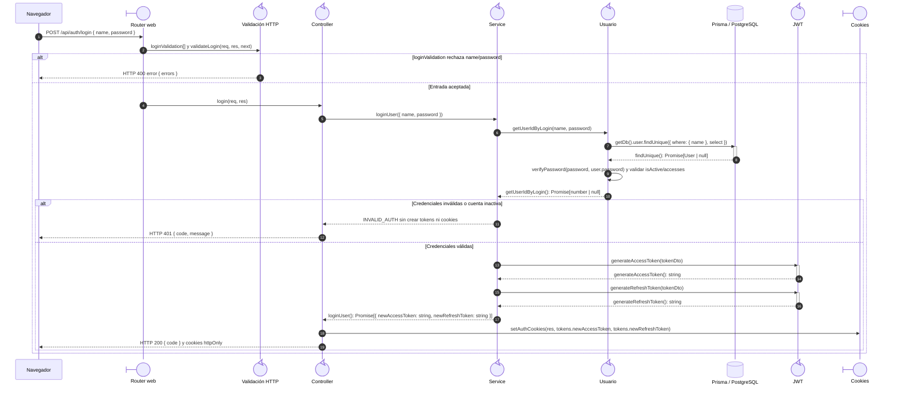

# `CU-AUT-01` — Iniciar sesión

**Patrones:** `BE-P01`, `BE-P08`.

## Participantes y trazabilidad

Los nombres breves del diagrama corresponden a los archivos vinculados siguientes.
La ruta completa se conserva en cada enlace, fuera de la cabecera visual. Un participante
puede agrupar colaboradores del mismo rol; esa agrupación no implica una clase ni un
proceso independiente. Los retornos representan el resultado o error propagado.

| Alias | Rol visual | Archivos de implementación |
| --- | --- | --- |
| `Router` | boundary | [`authApiRoute.js`](../../../../../../src/routes/api/authApiRoute.js) |
| `Validator` | control | [`authValidations.js`](../../../../../../src/validators/forms/authValidations.js) [`validatorMiddleware.js`](../../../../../../src/middleware/validatorMiddleware.js) |
| `Controller` | control | [`authController.js`](../../../../../../src/controllers/api/authController.js) |
| `Service` | control | [`authService.js`](../../../../../../src/services/authService.js) |
| `User` | control | [`userService.js`](../../../../../../src/services/admin/userService.js) |
| `Token` | control | [`jwtService.js`](../../../../../../src/services/jwtService.js) |
| `Cookies` | boundary | [`cookiesUtils.js`](../../../../../../src/utils/cookiesUtils.js) |

## Secuencia de implementación

