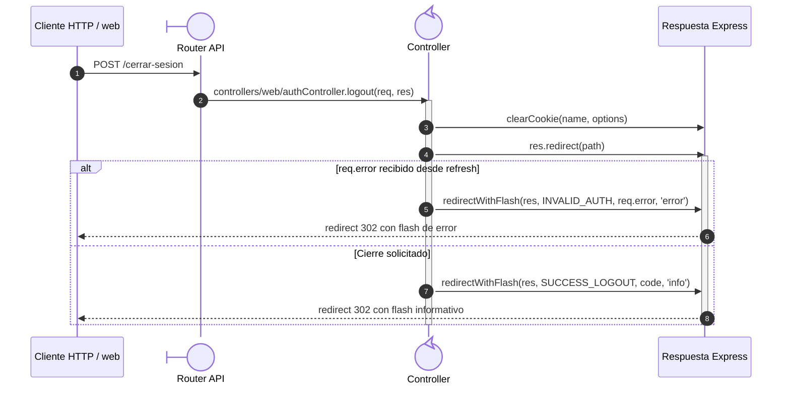

# `CU-AUT-02` — Cerrar sesión

**Patrones:** `BE-P08`.

## Participantes y trazabilidad

Los nombres breves del diagrama corresponden a los archivos vinculados siguientes.
La ruta completa se conserva en cada enlace, fuera de la cabecera visual. Un participante
puede agrupar colaboradores del mismo rol; esa agrupación no implica una clase ni un
proceso independiente. Los retornos representan el resultado o error propagado.

| Alias | Rol visual | Archivos de implementación |
| --- | --- | --- |
| `Route` | boundary | [`logoutWebRoute.js`](../../../../../../src/routes/web/auth/logoutWebRoute.js) |
| `Controller` | control | [`authController.js`](../../../../../../src/controllers/web/authController.js) |

## Secuencia de implementación

