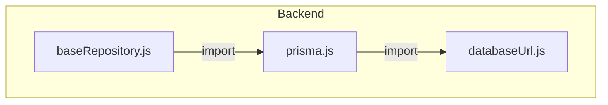

# `CU-ALM-01` — Consultar materiales

**Patrones:** `BE-P01`.

## Participantes y trazabilidad

Cada línea de vida técnica corresponde a un único archivo de implementación, indicado
por su alias en la tabla. Dos archivos distintos usan participantes distintos. Los actores,
el navegador y la frontera de persistencia son elementos externos, no archivos del proyecto.
Los retornos representan el resultado o error de la función ejecutada en el archivo indicado.
La composición incluye también los archivos de configuración, construcción y reexport: cada
uno tiene un nodo propio, aunque no ejecute una delegación durante la petición.

| Alias | Rol visual | Archivo de implementación |
| --- | --- | --- |
| `Route` | boundary | [`materialApiRoute.js`](../../../../../../src/routes/api/warehouse/materialApiRoute.js) |
| `Controller` | control | [`materialController.js`](../../../../../../src/controllers/api/warehouse/materialController.js) |
| `Domain` | control | [`materialService.js`](../../../../../../src/services/warehouse/materials/materialService.js) |
| `SupplierMaterial` | control | [`supplierMaterialService.js`](../../../../../../src/services/warehouse/materials/supplierMaterialService.js) |
| `ErrorHandler` | control | [`app.js`](../../../../../../src/app.js) |
| `Auth` | control | [`authMiddleware.js`](../../../../../../src/middleware/authMiddleware.js) |
| `FileBaseRepository` | control | [`baseRepository.js`](../../../../../../src/repository/baseRepository.js) |
| `FilePrisma` | control | [`prisma.js`](../../../../../../src/lib/prisma.js) |
| `FileDatabaseUrl` | control | [`databaseUrl.js`](../../../../../../src/lib/databaseUrl.js) |

## Composición de archivos

Los archivos que construyen, configuran o reexportan funciones aparecen como componentes
individuales. Las flechas representan imports reales, resueltos al cargar los módulos;
las llamadas durante la operación se muestran en las secuencias siguientes. Cada nombre
identifica un archivo y la tabla conserva su ruta completa.

## Secuencia de implementación

```mermaid
sequenceDiagram
    autonumber
    participant Client as Cliente HTTP / web
    participant Route@{ "type": "boundary" } as materialApiRoute.js
    participant Auth@{ "type": "control" } as authMiddleware.js
    participant Controller@{ "type": "control" } as materialController.js
    participant Domain@{ "type": "control" } as materialService.js
    participant SupplierMaterial@{ "type": "control" } as supplierMaterialService.js
    participant Prisma@{ "type": "database" } as Prisma / PostgreSQL
    participant ErrorHandler@{ "type": "control" } as app.js

    participant FileBaseRepository@{ "type": "control" } as baseRepository.js

    Client->>Route: GET /api/warehouse/materials

    Route->>Auth: verifyApiTokenRequired(req, res, next)
    activate Auth
    break Token ausente o inválido
        Auth-->>Client: HTTP 401 INVALID_AUTH
    end
    deactivate Auth
    Route->>Auth: authorizeUserApi(PERMISSIONS.MATERIALS_READ)(req, res, next)
    activate Auth
    break Identidad no vigente o permiso denegado
        Auth-->>Client: HTTP 401 INVALID_AUTH o HTTP 403 FORBIDDEN
    end
    deactivate Auth
    Route->>Controller: getAllMaterials(req, res)
    activate Controller
    Controller->>Domain: findAllMaterials({ paginación, filtros, orden, canReadCosts })
    activate Domain
    Domain->>SupplierMaterial: findAllSupplierMaterials({ ... })
    SupplierMaterial->>FileBaseRepository: getDb(tx)
    FileBaseRepository-->>SupplierMaterial: getDb(): PrismaClient | TransactionClient — conserva tx
    SupplierMaterial->>Prisma: supplierMaterial.findMany({ select: { material, supplier, existencia } })
    activate Prisma
    Prisma-->>SupplierMaterial: findMany(): Promise[SupplierMaterial[]]
    deactivate Prisma
    SupplierMaterial->>Prisma: material.findMany({ relaciones históricas: none })
    activate Prisma
    Prisma-->>SupplierMaterial: findMany(): Promise[{ id: number }[]]
    deactivate Prisma
    SupplierMaterial->>Prisma: supplierMaterial.count({ where })
    activate Prisma
    Prisma-->>SupplierMaterial: count(): Promise[number]
    deactivate Prisma
    SupplierMaterial-->>Domain: findAllSupplierMaterials(): Promise[{ data: SupplierMaterial[], recordsTotal: number, recordsFiltered: number }]
    alt Servicio resuelto
        Domain-->>Controller: findAllMaterials(): Promise[{ data: SupplierMaterial[], recordsTotal: number, recordsFiltered: number }]
        Controller-->>Client: HTTP 200 { data: [{ id, material, supplier, ... }], recordsTotal, recordsFiltered }
    else AppError propagado
        Domain-->>Controller: throw AppError { code, message, meta, statusCode }
        Controller->>ErrorHandler: next(error)
        ErrorHandler-->>Client: res.status(error.statusCode).json({ code, message, meta })
    end
    deactivate Domain
    deactivate Controller
```

