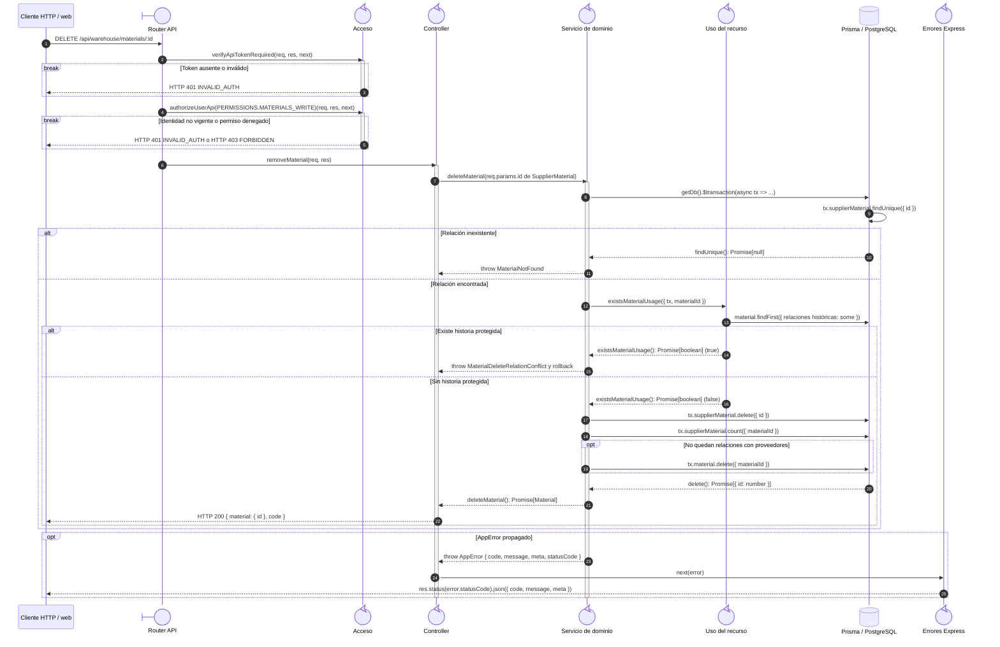

# `CU-ALM-04` — Retirar material

**Patrones:** `BE-P01`, `BE-P03`, `BE-P04`.

## Participantes y trazabilidad

Los nombres breves del diagrama corresponden a los archivos vinculados siguientes.
La ruta completa se conserva en cada enlace, fuera de la cabecera visual. Un participante
puede agrupar colaboradores del mismo rol; esa agrupación no implica una clase ni un
proceso independiente. Los retornos representan el resultado o error propagado.

| Alias | Rol visual | Archivos de implementación |
| --- | --- | --- |
| `Route` | boundary | [`materialApiRoute.js`](../../../../../../src/routes/api/warehouse/materialApiRoute.js) |
| `Controller` | control | [`materialController.js`](../../../../../../src/controllers/api/warehouse/materialController.js) |
| `Domain` | control | [`materialService.js`](../../../../../../src/services/warehouse/materials/materialService.js) |
| `Usage` | control | [`supplierMaterialService.js`](../../../../../../src/services/warehouse/materials/supplierMaterialService.js) |
| `ErrorHandler` | control | [`app.js`](../../../../../../src/app.js) |

| `Auth` | control | [`authMiddleware.js`](../../../../../../src/middleware/authMiddleware.js) |

## Secuencia de implementación

