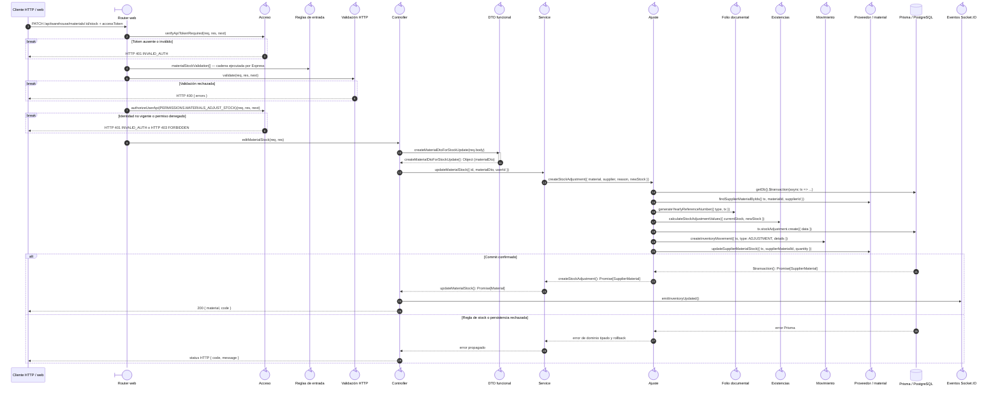

# `CU-ALM-05` — Ajustar existencia de material

**Patrones:** `BE-P01`, `BE-P03`, `BE-P04`, `BE-P05`.

## Participantes y trazabilidad

Cada línea de vida técnica corresponde a un único archivo de implementación, indicado
por su alias en la tabla. Dos archivos distintos usan participantes distintos. Los actores,
el navegador y la frontera de persistencia son elementos externos, no archivos del proyecto.
Los retornos representan el resultado o error de la función ejecutada en el archivo indicado.

| Alias | Rol visual | Archivo de implementación |
| --- | --- | --- |
| `Router` | boundary | [`materialApiRoute.js`](../../../../../../src/routes/api/warehouse/materialApiRoute.js) |
| `Auth` | control | [`authMiddleware.js`](../../../../../../src/middleware/authMiddleware.js) |
| `Validator` | control | [`validatorMiddleware.js`](../../../../../../src/middleware/validatorMiddleware.js) |
| `Controller` | control | [`materialController.js`](../../../../../../src/controllers/api/warehouse/materialController.js) |
| `StockDto` | control | [`materialDTO.js`](../../../../../../src/dtos/materialDTO.js) |
| `Service` | control | [`materialService.js`](../../../../../../src/services/warehouse/materials/materialService.js) |
| `Adjustment` | control | [`adjustmentService.js`](../../../../../../src/services/warehouse/adjustmentService.js) |
| `Reference` | control | [`referenceNumberService.js`](../../../../../../src/services/document/referenceNumberService.js) |
| `Stock` | control | [`stockHelpers.js`](../../../../../../src/services/inventory/stockHelpers.js) |
| `Movement` | control | [`movementService.js`](../../../../../../src/services/inventory/movementService.js) |
| `SupplierMaterial` | control | [`supplierMaterialService.js`](../../../../../../src/services/warehouse/materials/supplierMaterialService.js) |
| `Socket` | control | [`socketUtils.js`](../../../../../../src/utils/socketUtils.js) |
| `ValidationRules` | control | [`materialValidations.js`](../../../../../../src/validators/forms/materialValidations.js) |

## Secuencia de implementación

