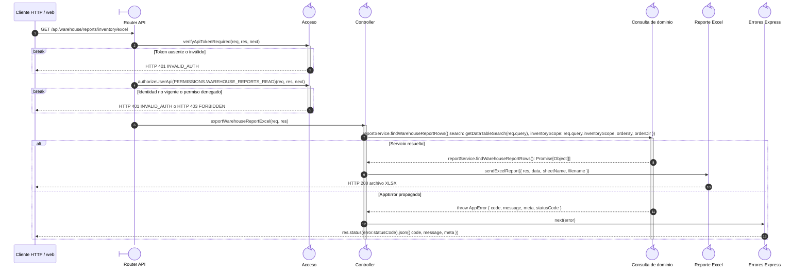

# `CU-ALM-06` — Generar reporte de inventario de materiales

**Patrones:** `BE-P07`.

## Participantes y trazabilidad

Cada línea de vida técnica corresponde a un único archivo de implementación, indicado
por su alias en la tabla. Dos archivos distintos usan participantes distintos. Los actores,
el navegador y la frontera de persistencia son elementos externos, no archivos del proyecto.
Los retornos representan el resultado o error de la función ejecutada en el archivo indicado.

| Alias | Rol visual | Archivo de implementación |
| --- | --- | --- |
| `Route` | boundary | [`reportApiRoute.js`](../../../../../../src/routes/api/warehouse/reportApiRoute.js) |
| `Controller` | control | [`reportController.js`](../../../../../../src/controllers/api/warehouse/reportController.js) |
| `Query` | control | [`reportService.js`](../../../../../../src/services/warehouse/reportService.js) |
| `Excel` | control | [`reportExcelUtils.js`](../../../../../../src/utils/reportExcelUtils.js) |
| `ErrorHandler` | control | [`app.js`](../../../../../../src/app.js) |
| `Auth` | control | [`authMiddleware.js`](../../../../../../src/middleware/authMiddleware.js) |

## Secuencia de implementación

