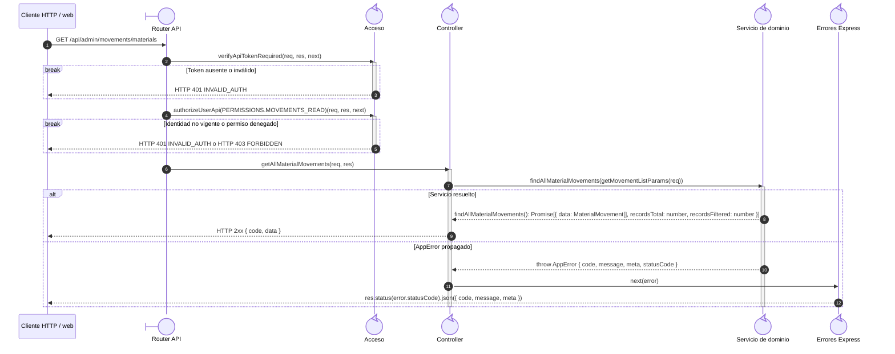

# `CU-ALM-07` — Consultar movimientos de materiales

**Patrones:** `BE-P06`.

## Participantes y trazabilidad

Cada línea de vida técnica corresponde a un único archivo de implementación, indicado
por su alias en la tabla. Dos archivos distintos usan participantes distintos. Los actores,
el navegador y la frontera de persistencia son elementos externos, no archivos del proyecto.
Los retornos representan el resultado o error de la función ejecutada en el archivo indicado.

| Alias | Rol visual | Archivo de implementación |
| --- | --- | --- |
| `Route` | boundary | [`movementApiRoute.js`](../../../../../../src/routes/api/admin/movementApiRoute.js) |
| `Controller` | control | [`movementController.js`](../../../../../../src/controllers/api/admin/movementController.js) |
| `Domain` | control | [`movementQueryService.js`](../../../../../../src/services/inventory/movementQueryService.js) |
| `ErrorHandler` | control | [`app.js`](../../../../../../src/app.js) |
| `Auth` | control | [`authMiddleware.js`](../../../../../../src/middleware/authMiddleware.js) |

## Secuencia de implementación

