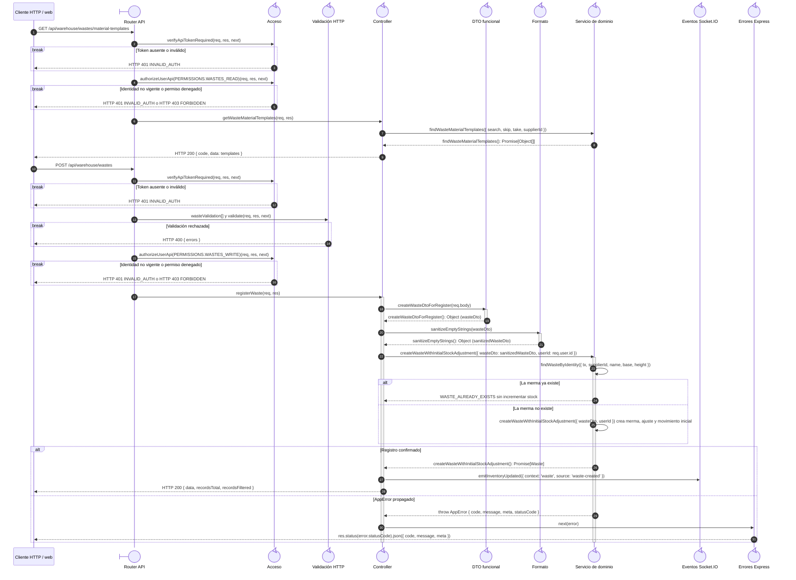

# `CU-ALM-10` — Registrar merma

**Patrones:** `BE-P01`, `BE-P03`, `BE-P04`, `BE-P05`.

## Participantes y trazabilidad

Los nombres breves del diagrama corresponden a los archivos vinculados siguientes.
La ruta completa se conserva en cada enlace, fuera de la cabecera visual. Un participante
puede agrupar colaboradores del mismo rol; esa agrupación no implica una clase ni un
proceso independiente. Los retornos representan el resultado o error propagado.

| Alias | Rol visual | Archivos de implementación |
| --- | --- | --- |
| `Route` | boundary | [`wasteApiRoute.js`](../../../../../../src/routes/api/warehouse/wasteApiRoute.js) |
| `Auth` | control | [`authMiddleware.js`](../../../../../../src/middleware/authMiddleware.js) |
| `Validator` | control | [`wasteValidations.js`](../../../../../../src/validators/forms/wasteValidations.js) [`validatorMiddleware.js`](../../../../../../src/middleware/validatorMiddleware.js) |
| `Controller` | control | [`wasteController.js`](../../../../../../src/controllers/api/warehouse/wasteController.js) |
| `WasteDto` | control | [`wasteDTO.js`](../../../../../../src/dtos/wasteDTO.js) |
| `Formatter` | control | [`formattersUtils.js`](../../../../../../src/utils/formattersUtils.js) |
| `Domain` | control | [`wasteMaterialService.js`](../../../../../../src/services/warehouse/wastes/wasteMaterialService.js) [`wasteService.js`](../../../../../../src/services/warehouse/wastes/wasteService.js) |
| `Socket` | control | [`socketUtils.js`](../../../../../../src/utils/socketUtils.js) |
| `ErrorHandler` | control | [`app.js`](../../../../../../src/app.js) |

## Secuencia de implementación

