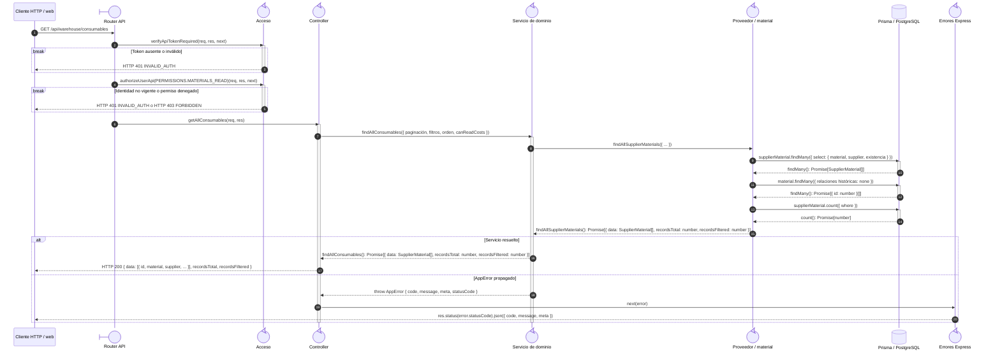

# `CU-ALM-17` — Consultar consumibles

**Patrones:** `BE-P01`.

## Participantes y trazabilidad

Los nombres breves del diagrama corresponden a los archivos vinculados siguientes.
La ruta completa se conserva en cada enlace, fuera de la cabecera visual. Un participante
puede agrupar colaboradores del mismo rol; esa agrupación no implica una clase ni un
proceso independiente. Los retornos representan el resultado o error propagado.

| Alias | Rol visual | Archivos de implementación |
| --- | --- | --- |
| `Route` | boundary | [`consumableApiRoute.js`](../../../../../../src/routes/api/warehouse/consumableApiRoute.js) |
| `Controller` | control | [`consumableController.js`](../../../../../../src/controllers/api/warehouse/consumableController.js) |
| `Domain` | control | [`consumableService.js`](../../../../../../src/services/warehouse/consumables/consumableService.js) |
| `SupplierMaterial` | control | [`supplierMaterialService.js`](../../../../../../src/services/warehouse/materials/supplierMaterialService.js) |
| `ErrorHandler` | control | [`app.js`](../../../../../../src/app.js) |

| `Auth` | control | [`authMiddleware.js`](../../../../../../src/middleware/authMiddleware.js) |

## Secuencia de implementación

