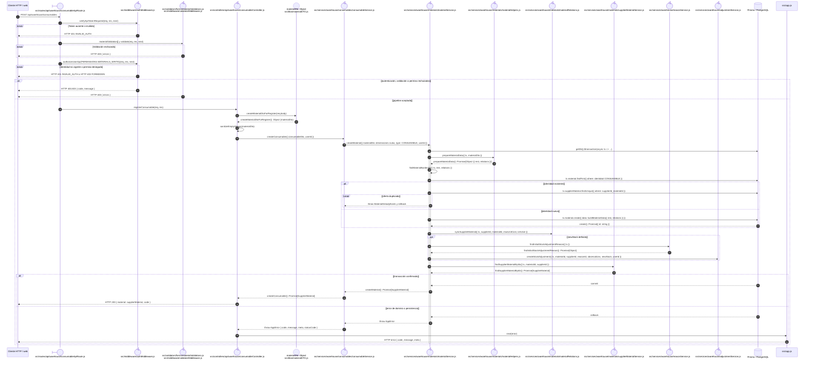

# `CU-ALM-18` — Crear consumible

**Patrones:** `BE-P01`, `BE-P03`, `BE-P04`.

```mermaid
sequenceDiagram
    autonumber
    participant Client as Cliente HTTP / web
    participant Route@{ "type": "boundary" } as src/routes/api/warehouse/consumableApiRoute.js
    participant Auth@{ "type": "control" } as src/middleware/authMiddleware.js
    participant Validator@{ "type": "control" } as src/validators/forms/materialValidations.js<br/>src/middleware/validatorMiddleware.js
    participant Controller@{ "type": "control" } as src/controllers/api/warehouse/consumableController.js
    participant MaterialDto@{ "type": "entity" } as materialDto: Object<br/>src/dtos/materialDTO.js
    participant Domain@{ "type": "control" } as src/services/warehouse/consumables/consumableService.js
    participant MaterialService@{ "type": "control" } as src/services/warehouse/materials/materialService.js
    participant Helpers@{ "type": "control" } as src/services/warehouse/materials/materialHelpers.js
    participant Relations@{ "type": "control" } as src/services/warehouse/materials/materialRelations.js
    participant SupplierMaterial@{ "type": "control" } as src/services/warehouse/materials/supplierMaterialService.js
    participant Reason@{ "type": "control" } as src/services/warehouse/reasonService.js
    participant Adjustment@{ "type": "control" } as src/services/warehouse/adjustmentService.js
    participant Prisma@{ "type": "database" } as Prisma / PostgreSQL
    participant ErrorHandler as src/app.js

    Client->>Route: POST /api/warehouse/consumables
    Route->>Auth: verifyApiTokenRequired(req, res, next)
    break Token ausente o inválido
        Auth-->>Client: HTTP 401 INVALID_AUTH
    end
    Route->>Validator: materialValidation[] y validate(req, res, next)
    break Validación rechazada
        Validator-->>Client: HTTP 400 { errors }
    end
    Route->>Auth: authorizeUserApi(PERMISSIONS.MATERIALS_WRITE)(req, res, next)
    break Identidad no vigente o permiso denegado
        Auth-->>Client: HTTP 401 INVALID_AUTH o HTTP 403 FORBIDDEN
    end
    alt [autenticación, validación o permiso rechazados]
        Auth-->>Client: HTTP 401/403 { code, message }
        Validator-->>Client: HTTP 400 { errors }
    else [pipeline aceptado]
        Route->>Controller: registerConsumable(req, res)
        Controller->>MaterialDto: createMaterialDtoForRegister(req.body)
        MaterialDto-->>Controller: createMaterialDtoForRegister(): Object (materialDto)
        Controller->>Controller: sanitizeEmptyStrings(materialDto)
        Controller->>Domain: createConsumable({ consumableDto, userId })
        Domain->>MaterialService: createMaterial({ materialDto: dimensiones nulas, type: CONSUMABLE, userId })
        activate MaterialService
        MaterialService->>Prisma: getDb().$transaction(async tx => ...)
        MaterialService->>Helpers: prepareMaterialData({ tx, materialDto })
        Helpers-->>MaterialService: prepareMaterialData(): Promise[Object ({ rest, relations })]
        MaterialService->>MaterialService: findMaterialByIdentity({ tx, rest, relations })
        MaterialService->>Prisma: tx.material.findFirst({ where: identidad CONSUMABLE })
        alt [identidad existente]
            MaterialService->>Prisma: tx.supplierMaterial.findUnique({ where: supplierId_materialId })
            break [oferta duplicada]
                MaterialService-->>Domain: throw MaterialAlreadyExists y rollback
            end
        else [identidad nueva]
            MaterialService->>Prisma: tx.material.create({ data: buildMaterialData({ rest, relations }) })
            Prisma-->>MaterialService: create(): Promise[{ id: string }]
        end
        MaterialService->>Relations: syncSupplierMaterial({ tx, supplierId, materialId, maxUnitCost, isActive })
        opt [newStock definido]
            MaterialService->>Reason: findInitialStockAdjustmentReason({ tx })
            Reason-->>MaterialService: findInitialStockAdjustmentReason(): Promise[Object]
            MaterialService->>Adjustment: createStockAdjustment({ tx, materialId, supplierId, reasonId, observations, newStock, userId })
        end
        MaterialService->>SupplierMaterial: findSupplierMaterialByIds({ tx, materialId, supplierId })
        SupplierMaterial-->>MaterialService: findSupplierMaterialByIds(): Promise[SupplierMaterial]
        alt [transacción confirmada]
            Prisma-->>MaterialService: commit
            MaterialService-->>Domain: createMaterial(): Promise[SupplierMaterial]
            Domain-->>Controller: createConsumable(): Promise[SupplierMaterial]
            Controller-->>Client: HTTP 200 { material: supplierMaterial, code }
        else [error de dominio o persistencia]
            Prisma-->>MaterialService: rollback
            MaterialService-->>Domain: throw AppError
            Domain-->>Controller: throw AppError { code, message, meta, statusCode }
            Controller->>ErrorHandler: next(error)
            ErrorHandler-->>Client: HTTP error { code, message, meta }
        end
        deactivate MaterialService
    end
```
