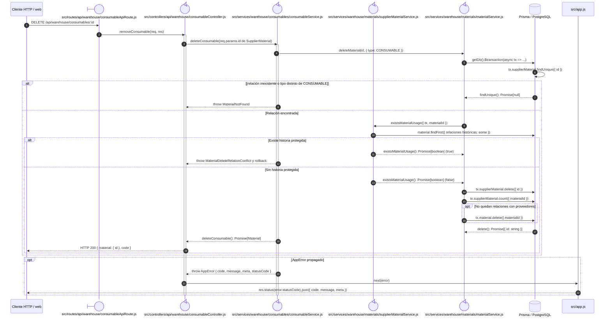

# `CU-ALM-20` — Retirar consumible

**Patrones:** `BE-P01`, `BE-P03`, `BE-P04`.

```mermaid
sequenceDiagram
    autonumber
    participant Client as Cliente HTTP / web
    participant Route@{ "type": "boundary" } as src/routes/api/warehouse/consumableApiRoute.js
    participant Controller@{ "type": "control" } as src/controllers/api/warehouse/consumableController.js
    participant Domain@{ "type": "control" } as src/services/warehouse/consumables/consumableService.js
    participant Usage@{ "type": "control" } as src/services/warehouse/materials/supplierMaterialService.js
    participant MaterialService@{ "type": "control" } as src/services/warehouse/materials/materialService.js
    participant Prisma@{ "type": "database" } as Prisma / PostgreSQL
    participant ErrorHandler as src/app.js

    Client->>Route: DELETE /api/warehouse/consumables/:id
    Route->>Controller: removeConsumable(req, res)
    activate Controller
    Controller->>Domain: deleteConsumable(req.params.id de SupplierMaterial)
    activate Domain
    Domain->>MaterialService: deleteMaterial(id, { type: CONSUMABLE })
    MaterialService->>Prisma: getDb().$transaction(async tx => ...)
    Prisma->>Prisma: tx.supplierMaterial.findUnique({ id })
    alt [relación inexistente o tipo distinto de CONSUMABLE]
        Prisma-->>MaterialService: findUnique(): Promise[null]
        Domain-->>Controller: throw MaterialNotFound
    else Relación encontrada
        MaterialService->>Usage: existsMaterialUsage({ tx, materialId })
        Usage->>Prisma: material.findFirst({ relaciones históricas: some })
        alt Existe historia protegida
            Usage-->>MaterialService: existsMaterialUsage(): Promise[boolean] (true)
            Domain-->>Controller: throw MaterialDeleteRelationConflict y rollback
        else Sin historia protegida
            Usage-->>MaterialService: existsMaterialUsage(): Promise[boolean] (false)
            MaterialService->>Prisma: tx.supplierMaterial.delete({ id })
            MaterialService->>Prisma: tx.supplierMaterial.count({ materialId })
            opt No quedan relaciones con proveedores
                MaterialService->>Prisma: tx.material.delete({ materialId })
            end
            Prisma-->>MaterialService: delete(): Promise[{ id: string }]
            Domain-->>Controller: deleteConsumable(): Promise[Material]
            Controller-->>Client: HTTP 200 { material: { id }, code }
        end
    end
    opt AppError propagado
        Domain-->>Controller: throw AppError { code, message, meta, statusCode }
        Controller->>ErrorHandler: next(error)
        ErrorHandler-->>Client: res.status(error.statusCode).json({ code, message, meta })
    end
    deactivate Domain
    deactivate Controller
```
