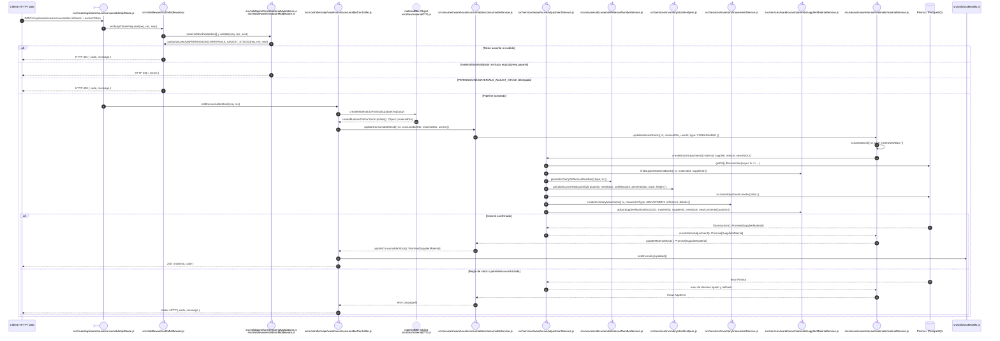

# `CU-ALM-21` — Ajustar existencia de consumible

**Patrones:** `BE-P01`, `BE-P03`, `BE-P04`, `BE-P05`.

```mermaid
sequenceDiagram
    autonumber
    participant Client as Cliente HTTP / web
    participant Router@{ "type": "boundary" } as src/routes/api/warehouse/consumableApiRoute.js
    participant Auth@{ "type": "control" } as src/middleware/authMiddleware.js
    participant Validator@{ "type": "control" } as src/validators/forms/materialValidations.js<br/>src/middleware/validatorMiddleware.js
    participant Controller@{ "type": "control" } as src/controllers/api/warehouse/consumableController.js
    participant StockDto@{ "type": "entity" } as materialDto: Object<br/>src/dtos/materialDTO.js
    participant Service@{ "type": "control" } as src/services/warehouse/consumables/consumableService.js
    participant Adjustment@{ "type": "control" } as src/services/warehouse/adjustmentService.js
    participant Reference@{ "type": "control" } as src/services/document/referenceNumberService.js
    participant Stock@{ "type": "control" } as src/services/inventory/stockHelpers.js
    participant Movement@{ "type": "control" } as src/services/inventory/movementService.js
    participant SupplierMaterial@{ "type": "control" } as src/services/warehouse/materials/supplierMaterialService.js
    participant MaterialService@{ "type": "control" } as src/services/warehouse/materials/materialService.js
    participant Prisma@{ "type": "database" } as Prisma / PostgreSQL
    participant Socket as src/utils/socketUtils.js

    Client->>Router: PATCH /api/warehouse/consumables/:id/stock + accessToken
    Router->>Auth: verifyApiTokenRequired(req, res, next)
    Auth->>Validator: materialStockValidation[] y validate(req, res, next)
    Validator->>Auth: authorizeUserApi(PERMISSIONS.MATERIALS_ADJUST_STOCK)(req, res, next)
    alt Token ausente o inválido
        Auth-->>Client: HTTP 401 { code, message }
    else materialStockValidation rechaza req.body/req.params
        Validator-->>Client: HTTP 400 { errors }
    else PERMISSIONS.MATERIALS_ADJUST_STOCK denegado
        Auth-->>Client: HTTP 403 { code, message }
    else Pipeline aceptado
        Router->>Controller: editConsumableStock(req, res)
        Controller->>StockDto: createMaterialDtoForStockUpdate(req.body)
        StockDto-->>Controller: createMaterialDtoForStockUpdate(): Object (materialDto)
        Controller->>Service: updateConsumableStock({ id, consumableDto: materialDto, userId })
        Service->>MaterialService: updateMaterialStock({ id, materialDto, userId, type: CONSUMABLE })
        MaterialService->>MaterialService: existsMaterial({ id, type: CONSUMABLE })
        MaterialService->>Adjustment: createStockAdjustment({ material, supplier, reason, newStock })
        Adjustment->>Prisma: getDb().$transaction(async tx => ...)
        Adjustment->>SupplierMaterial: findSupplierMaterialByIds({ tx, materialId, supplierId })
        Adjustment->>Reference: generateYearlyReferenceNumber({ type, tx })
        Adjustment->>Stock: calculateConvertedQuantity({ quantity: newStock, unitMeasure, presentation, base, height })
        Adjustment->>Prisma: tx.stockAdjustment.create({ data })
        Adjustment->>Movement: createInventoryMovement({ tx, movementType: ADJUSTMENT, reference, details })
        Adjustment->>SupplierMaterial: adjustSupplierMaterialStock({ tx, materialId, supplierId, newStock, newConvertedQuantity })
        alt Commit confirmado
            Prisma-->>Adjustment: $transaction(): Promise[SupplierMaterial]
            Adjustment-->>MaterialService: createStockAdjustment(): Promise[SupplierMaterial]
            MaterialService-->>Service: updateMaterialStock(): Promise[SupplierMaterial]
            Service-->>Controller: updateConsumableStock(): Promise[SupplierMaterial]
            Controller->>Socket: emitInventoryUpdated()
            Controller-->>Client: 200 { material, code }
        else Regla de stock o persistencia rechazada
            Prisma-->>Adjustment: error Prisma
            Adjustment-->>MaterialService: error de dominio tipado y rollback
            MaterialService-->>Service: throw AppError
            Service-->>Controller: error propagado
            Controller-->>Client: status HTTP { code, message }
        end
    end
```
