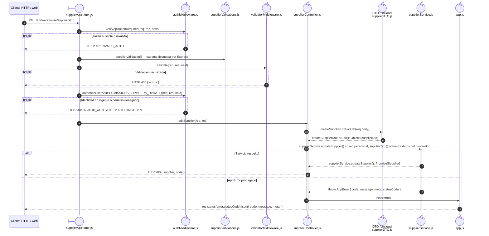

# `CU-CAT-03` — Editar proveedor

**Patrones:** `BE-P01`.

## Participantes y trazabilidad

Cada línea de vida técnica corresponde a un único archivo de implementación, indicado
por su alias en la tabla. Dos archivos distintos usan participantes distintos. Los actores,
el navegador y la frontera de persistencia son elementos externos, no archivos del proyecto.
Los retornos representan el resultado o error de la función ejecutada en el archivo indicado.
La composición incluye también los archivos de configuración, construcción y reexport: cada
uno tiene un nodo propio, aunque no ejecute una delegación durante la petición.

| Alias | Rol visual | Archivo de implementación |
| --- | --- | --- |
| `Route` | boundary | [`supplierApiRoute.js`](../../../../../../src/routes/api/warehouse/supplierApiRoute.js) |
| `Auth` | control | [`authMiddleware.js`](../../../../../../src/middleware/authMiddleware.js) |
| `Validator` | control | [`validatorMiddleware.js`](../../../../../../src/middleware/validatorMiddleware.js) |
| `Controller` | control | [`supplierController.js`](../../../../../../src/controllers/api/warehouse/supplierController.js) |
| `SupplierDto` | control | [`supplierDTO.js`](../../../../../../src/dtos/supplierDTO.js) |
| `Domain` | control | [`supplierService.js`](../../../../../../src/services/warehouse/supplierService.js) |
| `ErrorHandler` | control | [`app.js`](../../../../../../src/app.js) |
| `ValidationRules` | control | [`supplierValidations.js`](../../../../../../src/validators/forms/supplierValidations.js) |

## Secuencia de implementación

