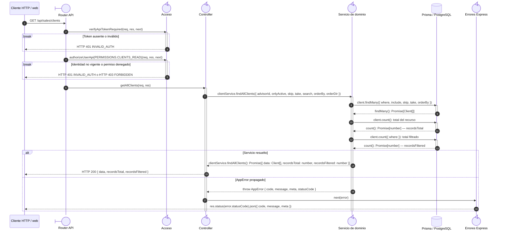

# `CU-CAT-05` — Consultar clientes

**Patrones:** `BE-P01`.

## Participantes y trazabilidad

Los nombres breves del diagrama corresponden a los archivos vinculados siguientes.
La ruta completa se conserva en cada enlace, fuera de la cabecera visual. Un participante
puede agrupar colaboradores del mismo rol; esa agrupación no implica una clase ni un
proceso independiente. Los retornos representan el resultado o error propagado.

| Alias | Rol visual | Archivos de implementación |
| --- | --- | --- |
| `Route` | boundary | [`clientApiRoute.js`](../../../../../../src/routes/api/sales/clientApiRoute.js) |
| `Controller` | control | [`clientController.js`](../../../../../../src/controllers/api/sales/clientController.js) |
| `Domain` | control | [`clientService.js`](../../../../../../src/services/sales/clientService.js) |
| `ErrorHandler` | control | [`app.js`](../../../../../../src/app.js) |

| `Auth` | control | [`authMiddleware.js`](../../../../../../src/middleware/authMiddleware.js) |

## Secuencia de implementación

