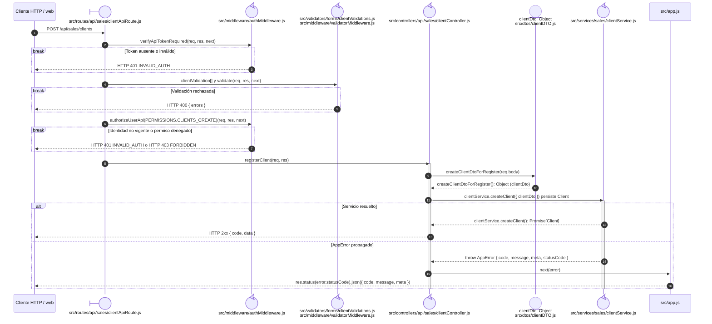

# `CU-CAT-06` — Crear cliente

**Patrones:** `BE-P01`.

El listado de Sistemas y el selector de una salida reutilizan el mismo `POST`. El permiso
`clients:create` autoriza el alta contextual de Almacén; `clients:page-view` continúa siendo un
permiso distinto exigido sólo por la ruta web independiente `/clientes`.

