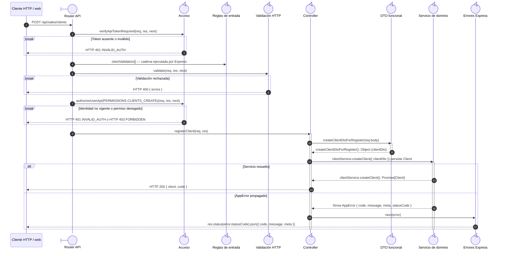

# `CU-CAT-06` — Crear cliente

**Patrones:** `BE-P01`.

El listado de Sistemas y el selector de una salida reutilizan el mismo `POST`. El permiso
`clients:create` autoriza el alta contextual de Almacén; `clients:page-view` continúa siendo un
permiso distinto exigido sólo por la ruta web independiente `/clientes`.

## Participantes y trazabilidad

Cada línea de vida técnica corresponde a un único archivo de implementación, indicado
por su alias en la tabla. Dos archivos distintos usan participantes distintos. Los actores,
el navegador y la frontera de persistencia son elementos externos, no archivos del proyecto.
Los retornos representan el resultado o error de la función ejecutada en el archivo indicado.

| Alias | Rol visual | Archivo de implementación |
| --- | --- | --- |
| `Route` | boundary | [`clientApiRoute.js`](../../../../../../src/routes/api/sales/clientApiRoute.js) |
| `Auth` | control | [`authMiddleware.js`](../../../../../../src/middleware/authMiddleware.js) |
| `Validator` | control | [`validatorMiddleware.js`](../../../../../../src/middleware/validatorMiddleware.js) |
| `Controller` | control | [`clientController.js`](../../../../../../src/controllers/api/sales/clientController.js) |
| `ClientDto` | control | [`clientDTO.js`](../../../../../../src/dtos/clientDTO.js) |
| `Domain` | control | [`clientService.js`](../../../../../../src/services/sales/clientService.js) |
| `ErrorHandler` | control | [`app.js`](../../../../../../src/app.js) |
| `ValidationRules` | control | [`clientValidations.js`](../../../../../../src/validators/forms/clientValidations.js) |

## Secuencia de implementación

