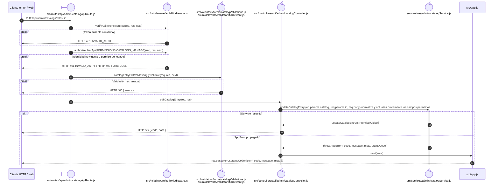

# `CU-CAT-14` — Editar rol

**Patrones:** `BE-P02`.

```mermaid
sequenceDiagram
    autonumber
    participant Client as Cliente HTTP / web
    participant Route@{ "type": "boundary" } as src/routes/api/admin/catalogApiRoute.js
    participant Auth@{ "type": "control" } as src/middleware/authMiddleware.js
    participant Validator@{ "type": "control" } as src/validators/forms/catalogValidations.js<br/>src/middleware/validatorMiddleware.js
    participant Controller@{ "type": "control" } as src/controllers/api/admin/catalogController.js
    participant Domain@{ "type": "control" } as src/services/admin/catalogService.js
    participant ErrorHandler as src/app.js

    Client->>Route: PUT /api/admin/catalogs/roles/:id
    Route->>Auth: verifyApiTokenRequired(req, res, next)
    break Token ausente o inválido
        Auth-->>Client: HTTP 401 INVALID_AUTH
    end
    Route->>Auth: authorizeUserApi(PERMISSIONS.CATALOGS_MANAGE)(req, res, next)
    break Identidad no vigente o permiso denegado
        Auth-->>Client: HTTP 401 INVALID_AUTH o HTTP 403 FORBIDDEN
    end
    Route->>Validator: catalogEntryEditValidation[] y validate(req, res, next)
    break Validación rechazada
        Validator-->>Client: HTTP 400 { errors }
    end
    Route->>Controller: editCatalogEntry(req, res)
    activate Controller
    Controller->>Domain: updateCatalogEntry(req.params.catalog, req.params.id, req.body) normaliza y actualiza únicamente los campos permitidos
    activate Domain
    alt Servicio resuelto
        Domain-->>Controller: updateCatalogEntry(): Promise[Object]
        Controller-->>Client: HTTP 2xx { code, data }
    else AppError propagado
        Domain-->>Controller: throw AppError { code, message, meta, statusCode }
        Controller->>ErrorHandler: next(error)
        ErrorHandler-->>Client: res.status(error.statusCode).json({ code, message, meta })
    end
    deactivate Domain
    deactivate Controller
```

