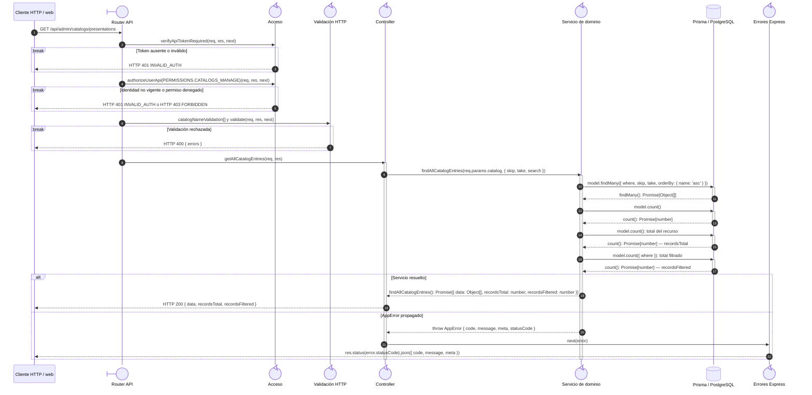

# `CU-CAT-15` — Consultar presentación

**Patrones:** `BE-P02`.

## Participantes y trazabilidad

Los nombres breves del diagrama corresponden a los archivos vinculados siguientes.
La ruta completa se conserva en cada enlace, fuera de la cabecera visual. Un participante
puede agrupar colaboradores del mismo rol; esa agrupación no implica una clase ni un
proceso independiente. Los retornos representan el resultado o error propagado.

| Alias | Rol visual | Archivos de implementación |
| --- | --- | --- |
| `Route` | boundary | [`catalogApiRoute.js`](../../../../../../src/routes/api/admin/catalogApiRoute.js) |
| `Auth` | control | [`authMiddleware.js`](../../../../../../src/middleware/authMiddleware.js) |
| `Validator` | control | [`catalogValidations.js`](../../../../../../src/validators/forms/catalogValidations.js) [`validatorMiddleware.js`](../../../../../../src/middleware/validatorMiddleware.js) |
| `Controller` | control | [`catalogController.js`](../../../../../../src/controllers/api/admin/catalogController.js) |
| `Domain` | control | [`catalogService.js`](../../../../../../src/services/admin/catalogService.js) |
| `ErrorHandler` | control | [`app.js`](../../../../../../src/app.js) |

## Secuencia de implementación

