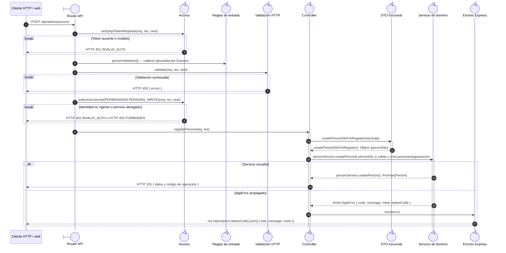

# `CU-IDA-02` — Crear persona

**Patrones:** `BE-P01`, `BE-P03`, `BE-P04`.

## Participantes y trazabilidad

Cada línea de vida técnica corresponde a un único archivo de implementación, indicado
por su alias en la tabla. Dos archivos distintos usan participantes distintos. Los actores,
el navegador y la frontera de persistencia son elementos externos, no archivos del proyecto.
Los retornos representan el resultado o error de la función ejecutada en el archivo indicado.

| Alias | Rol visual | Archivo de implementación |
| --- | --- | --- |
| `Route` | boundary | [`personApiRoute.js`](../../../../../../src/routes/api/admin/personApiRoute.js) |
| `Auth` | control | [`authMiddleware.js`](../../../../../../src/middleware/authMiddleware.js) |
| `Validator` | control | [`validatorMiddleware.js`](../../../../../../src/middleware/validatorMiddleware.js) |
| `Controller` | control | [`personController.js`](../../../../../../src/controllers/api/admin/personController.js) |
| `PersonDto` | control | [`personDTO.js`](../../../../../../src/dtos/personDTO.js) |
| `Domain` | control | [`personService.js`](../../../../../../src/services/admin/person/personService.js) |
| `ErrorHandler` | control | [`app.js`](../../../../../../src/app.js) |
| `ValidationRules` | control | [`personValidations.js`](../../../../../../src/validators/forms/personValidations.js) |

## Secuencia de implementación

