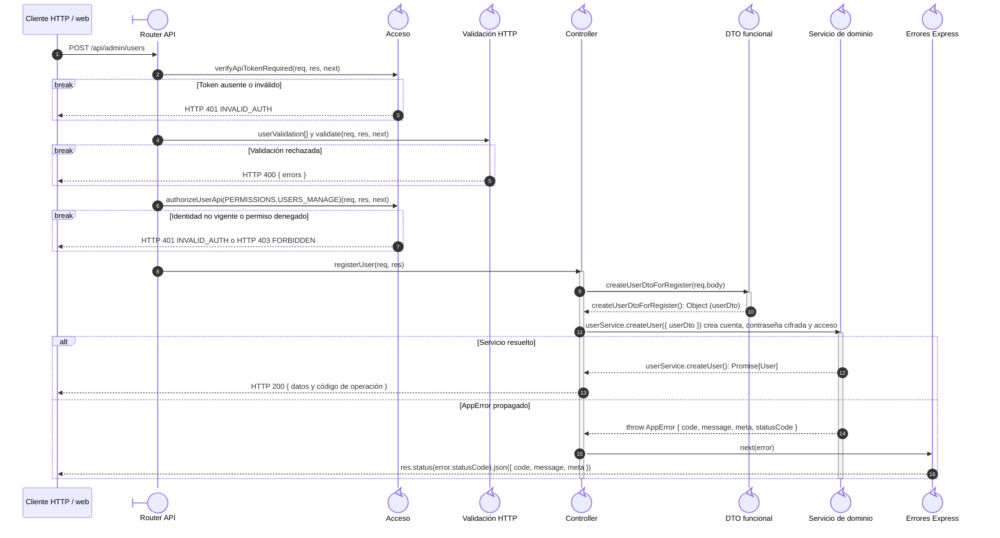

# `CU-IDA-06` — Crear usuario y asignar acceso

**Patrones:** `BE-P01`, `BE-P03`, `BE-P04`.

## Participantes y trazabilidad

Los nombres breves del diagrama corresponden a los archivos vinculados siguientes.
La ruta completa se conserva en cada enlace, fuera de la cabecera visual. Un participante
puede agrupar colaboradores del mismo rol; esa agrupación no implica una clase ni un
proceso independiente. Los retornos representan el resultado o error propagado.

| Alias | Rol visual | Archivos de implementación |
| --- | --- | --- |
| `Route` | boundary | [`userApiRoute.js`](../../../../../../src/routes/api/admin/userApiRoute.js) |
| `Auth` | control | [`authMiddleware.js`](../../../../../../src/middleware/authMiddleware.js) |
| `Validator` | control | [`userValidations.js`](../../../../../../src/validators/forms/userValidations.js) [`validatorMiddleware.js`](../../../../../../src/middleware/validatorMiddleware.js) |
| `Controller` | control | [`userController.js`](../../../../../../src/controllers/api/admin/userController.js) |
| `UserDto` | control | [`userDTO.js`](../../../../../../src/dtos/userDTO.js) |
| `Domain` | control | [`userService.js`](../../../../../../src/services/admin/userService.js) |
| `ErrorHandler` | control | [`app.js`](../../../../../../src/app.js) |

## Secuencia de implementación

