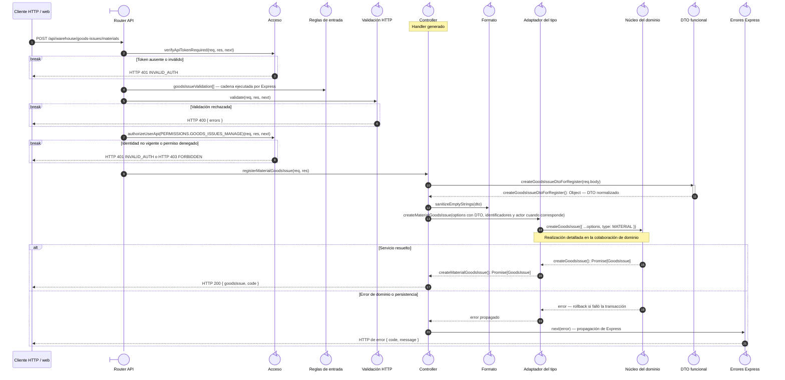
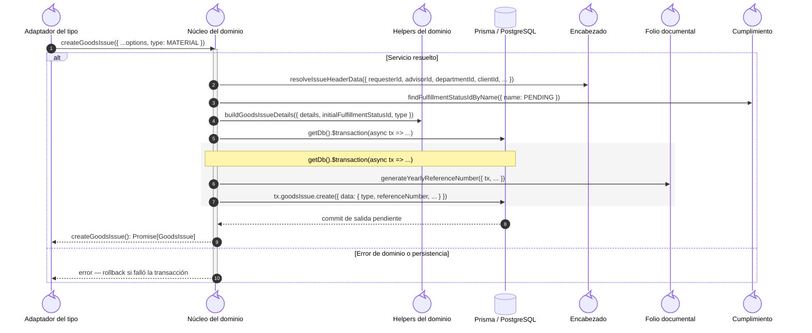

# `CU-SAL-02` — Crear salida de material

**Patrones:** `BE-P01`, `BE-P03`, `BE-P04`.

Si el selector crea un cliente, antes de esta secuencia el navegador completa el `POST
/api/sales/clients` de [`CU-CAT-06`](../catalogs/cu-cat-06.md#cu-cat-06). La salida recibe el
`clientId` resultante — ambas escrituras permanecen separadas y el alta no concede acceso a la ruta
web independiente de clientes.

## Participantes y trazabilidad

Cada línea de vida técnica corresponde a un único archivo de implementación, indicado
por su alias en la tabla. Dos archivos distintos usan participantes distintos. Los actores,
el navegador y la frontera de persistencia son elementos externos, no archivos del proyecto.
Los retornos representan el resultado o error de la función ejecutada en el archivo indicado.

| Alias | Rol visual | Archivo de implementación |
| --- | --- | --- |
| `Route` | boundary | [`materialGoodsIssueApiRoute.js`](../../../../../../src/routes/api/warehouse/goodsIssues/materials/materialGoodsIssueApiRoute.js) |
| `Auth` | control | [`authMiddleware.js`](../../../../../../src/middleware/authMiddleware.js) |
| `Validator` | control | [`validatorMiddleware.js`](../../../../../../src/middleware/validatorMiddleware.js) |
| `Controller` | control | [`goodsIssueHandlers.js`](../../../../../../src/controllers/api/warehouse/goodsIssues/shared/goodsIssueHandlers.js) |
| `Facade` | control | [`materialGoodsIssueService.js`](../../../../../../src/services/warehouse/goodsIssues/materials/materialGoodsIssueService.js) |
| `Core` | control | [`goodsIssueService.js`](../../../../../../src/services/warehouse/goodsIssues/goodsIssueService.js) |
| `Helpers` | control | [`goodsIssueHelpers.js`](../../../../../../src/services/warehouse/goodsIssues/goodsIssueHelpers.js) |
| `Inventory` | control | [`movementService.js`](../../../../../../src/services/inventory/movementService.js) |
| `DTO` | control | [`goodsIssueDTO.js`](../../../../../../src/dtos/goodsIssueDTO.js) |
| `Header` | control | [`issueHeaderService.js`](../../../../../../src/services/warehouse/issues/issueHeaderService.js) |
| `ErrorHandler` | control | [`app.js`](../../../../../../src/app.js) |
| `Reference` | control | [`referenceNumberService.js`](../../../../../../src/services/document/referenceNumberService.js) |
| `Fulfillment` | control | [`fulfillmentStatusService.js`](../../../../../../src/services/warehouse/fulfillmentStatusService.js) |
| `ValidationRules` | control | [`goodsIssueValidations.js`](../../../../../../src/validators/forms/goodsIssueValidations.js) |
| `Formatter` | control | [`formattersUtils.js`](../../../../../../src/utils/formattersUtils.js) |

### Configuración y archivos de contexto

El módulo específico configura y exporta el handler generado en el archivo de la línea `Controller`: [`materialGoodsIssueController.js`](../../../../../../src/controllers/api/warehouse/goodsIssues/materials/materialGoodsIssueController.js).

## Secuencia de entrada y coordinación

El primer nivel conserva método, controles HTTP, normalización, adaptación del tipo,
respuesta y publicación. La llamada del adaptador al núcleo es la frontera que amplía
el segundo nivel; ambas figuras realizan el mismo caso, sin añadir otra operación.

## Colaboración interna del dominio

Este nivel amplía la invocación `Facade → Core` anterior. Conserva consultas, reglas,
helpers y contexto de persistencia. Su error retorna al adaptador y se propaga según
la primera figura; los mensajes se numeran de nuevo dentro de esta colaboración.

