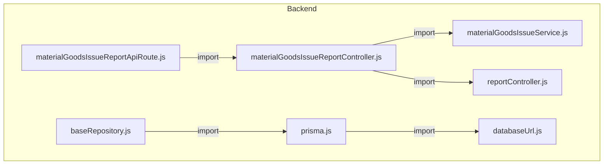
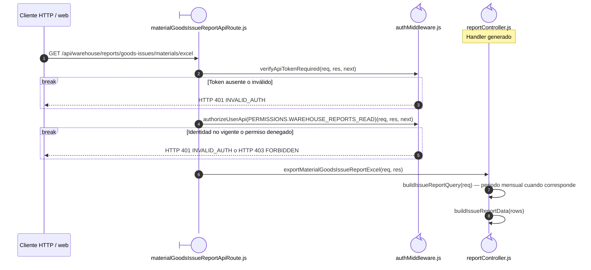
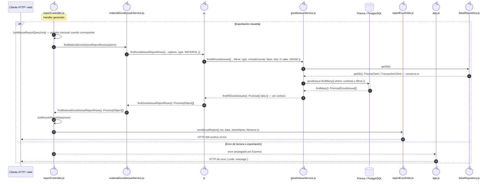

# `CU-SAL-07` — Generar reporte de salidas de material

**Patrones:** `BE-P07`.

## Participantes y trazabilidad

Cada línea de vida técnica corresponde a un único archivo de implementación, indicado
por su alias en la tabla. Dos archivos distintos usan participantes distintos. Los actores,
el navegador y la frontera de persistencia son elementos externos, no archivos del proyecto.
Los retornos representan el resultado o error de la función ejecutada en el archivo indicado.
La composición incluye también los archivos de configuración, construcción y reexport: cada
uno tiene un nodo propio, aunque no ejecute una delegación durante la petición.

| Alias | Rol visual | Archivo de implementación |
| --- | --- | --- |
| `Route` | boundary | [`materialGoodsIssueReportApiRoute.js`](../../../../../../src/routes/api/warehouse/goodsIssues/materials/materialGoodsIssueReportApiRoute.js) |
| `Auth` | control | [`authMiddleware.js`](../../../../../../src/middleware/authMiddleware.js) |
| `Controller` | control | [`reportController.js`](../../../../../../src/controllers/api/warehouse/reportController.js) |
| `Facade` | control | [`materialGoodsIssueService.js`](../../../../../../src/services/warehouse/goodsIssues/materials/materialGoodsIssueService.js) |
| `Query` | control | [`reportService.js`](../../../../../../src/services/warehouse/reportService.js) |
| `List` | control | [`goodsIssueService.js`](../../../../../../src/services/warehouse/goodsIssues/goodsIssueService.js) |
| `Excel` | control | [`reportExcelUtils.js`](../../../../../../src/utils/reportExcelUtils.js) |
| `ErrorHandler` | control | [`app.js`](../../../../../../src/app.js) |
| `FileMaterialGoodsIssueReportController` | control | [`materialGoodsIssueReportController.js`](../../../../../../src/controllers/api/warehouse/goodsIssues/materials/materialGoodsIssueReportController.js) |
| `FileBaseRepository` | control | [`baseRepository.js`](../../../../../../src/repository/baseRepository.js) |
| `FilePrisma` | control | [`prisma.js`](../../../../../../src/lib/prisma.js) |
| `FileDatabaseUrl` | control | [`databaseUrl.js`](../../../../../../src/lib/databaseUrl.js) |

### Configuración y construcción

El módulo específico configura y exporta el handler generado en el archivo de la línea `Controller`: [`materialGoodsIssueReportController.js`](../../../../../../src/controllers/api/warehouse/goodsIssues/materials/materialGoodsIssueReportController.js).

## Composición de archivos

Los archivos que construyen, configuran o reexportan funciones aparecen como componentes
individuales. Las flechas representan imports reales, resueltos al cargar los módulos;
las llamadas durante la operación se muestran en las secuencias siguientes. Cada nombre
identifica un archivo y la tabla conserva su ruta completa.

## Construcción de funciones para esta operación

El configurador se ejecuta al evaluar su módulo. Después se invoca la función devuelta
por la fábrica, usando el nombre público mostrado en la secuencia.

| Nombre público | Archivo configurador (alias) | Archivo que construye el cuerpo (alias) |
| --- | --- | --- |
| `exportMaterialGoodsIssueReportExcel` | `FileMaterialGoodsIssueReportController` | `Controller` · `buildGoodsIssueReportHandler(...)` |

## Secuencia de implementación

## Detalle de coordinación del controller

Continúa la colaboración anterior. Conserva el orden de los mensajes del código y
separa los archivos que ejecutan esta parte del recorrido; los otros detalles del caso
completan las llamadas a helpers y la propagación del resultado.

