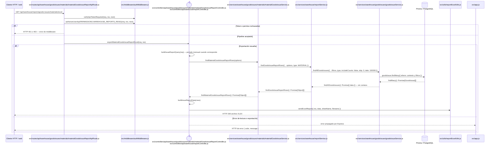

# `CU-SAL-07` — Generar reporte de salidas de material

**Patrones:** `BE-P07`.

    opt Error de lectura o exportación
        Controller-->>ErrorHandler: error propagado por Express
        ErrorHandler-->>Client: HTTP de error { code, message }
        end
    end

