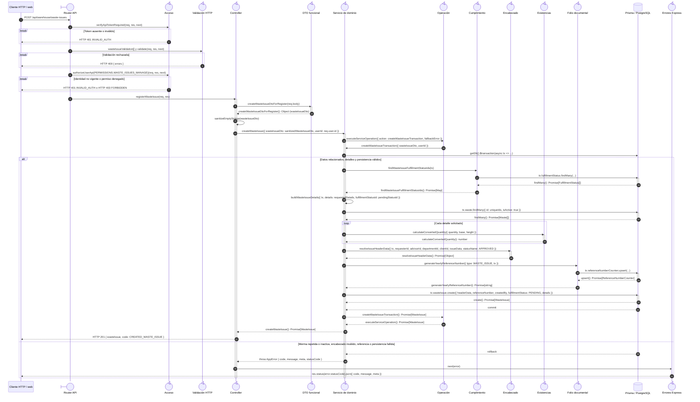

# `CU-SAL-09` — Crear salida de merma

**Patrones:** `BE-P01`, `BE-P03`, `BE-P04`.

## Participantes y trazabilidad

Los nombres breves del diagrama corresponden a los archivos vinculados siguientes.
La ruta completa se conserva en cada enlace, fuera de la cabecera visual. Un participante
puede agrupar colaboradores del mismo rol; esa agrupación no implica una clase ni un
proceso independiente. Los retornos representan el resultado o error propagado.

| Alias | Rol visual | Archivos de implementación |
| --- | --- | --- |
| `Route` | boundary | [`wasteIssueApiRoute.js`](../../../../../../src/routes/api/warehouse/wasteIssueApiRoute.js) |
| `Auth` | control | [`authMiddleware.js`](../../../../../../src/middleware/authMiddleware.js) |
| `Validator` | control | [`wasteIssueValidations.js`](../../../../../../src/validators/forms/wasteIssueValidations.js) [`validatorMiddleware.js`](../../../../../../src/middleware/validatorMiddleware.js) |
| `Controller` | control | [`wasteIssueController.js`](../../../../../../src/controllers/api/warehouse/wasteIssueController.js) |
| `IssueDto` | control | [`wasteIssueDTO.js`](../../../../../../src/dtos/wasteIssueDTO.js) |
| `Domain` | control | [`wasteIssueService.js`](../../../../../../src/services/warehouse/wasteIssues/wasteIssueService.js) |
| `Operation` | control | [`serviceErrorHandler.js`](../../../../../../src/services/serviceErrorHandler.js) |
| `Fulfillment` | control | [`wasteIssueFulfillmentService.js`](../../../../../../src/services/warehouse/wasteIssues/wasteIssueFulfillmentService.js) |
| `Header` | control | [`issueHeaderService.js`](../../../../../../src/services/warehouse/issues/issueHeaderService.js) |
| `Stock` | control | [`stockHelpers.js`](../../../../../../src/services/inventory/stockHelpers.js) |
| `Reference` | control | [`referenceNumberService.js`](../../../../../../src/services/document/referenceNumberService.js) |
| `ErrorHandler` | control | [`app.js`](../../../../../../src/app.js) |

## Secuencia de implementación

