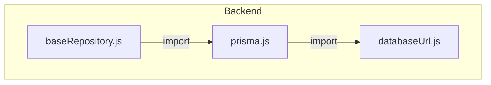
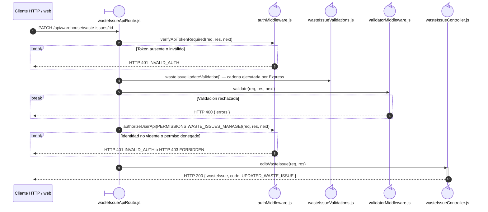
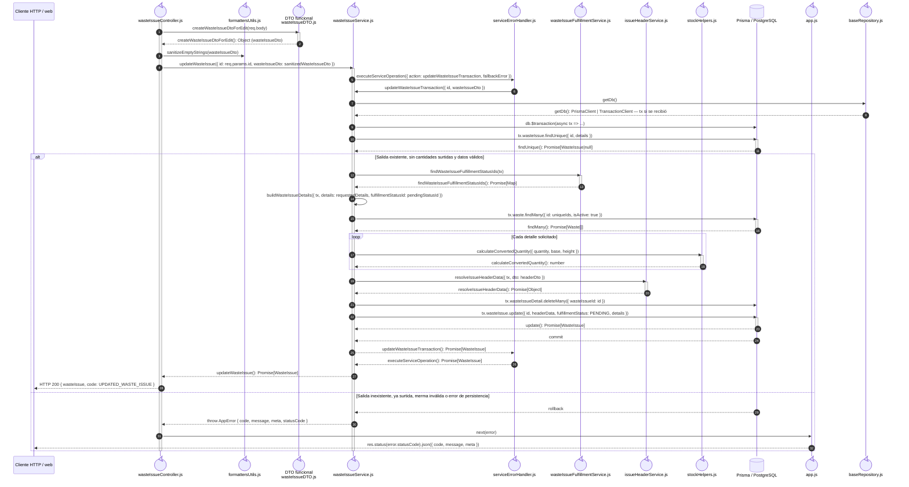

# `CU-SAL-11` — Editar detalles de merma de una salida

**Patrones:** `BE-P01`, `BE-P03`, `BE-P04`, `BE-P05`.

## Participantes y trazabilidad

Cada línea de vida técnica corresponde a un único archivo de implementación, indicado
por su alias en la tabla. Dos archivos distintos usan participantes distintos. Los actores,
el navegador y la frontera de persistencia son elementos externos, no archivos del proyecto.
Los retornos representan el resultado o error de la función ejecutada en el archivo indicado.
La composición incluye también los archivos de configuración, construcción y reexport: cada
uno tiene un nodo propio, aunque no ejecute una delegación durante la petición.

| Alias | Rol visual | Archivo de implementación |
| --- | --- | --- |
| `Route` | boundary | [`wasteIssueApiRoute.js`](../../../../../../src/routes/api/warehouse/wasteIssueApiRoute.js) |
| `Auth` | control | [`authMiddleware.js`](../../../../../../src/middleware/authMiddleware.js) |
| `Validator` | control | [`validatorMiddleware.js`](../../../../../../src/middleware/validatorMiddleware.js) |
| `Controller` | control | [`wasteIssueController.js`](../../../../../../src/controllers/api/warehouse/wasteIssueController.js) |
| `IssueDto` | control | [`wasteIssueDTO.js`](../../../../../../src/dtos/wasteIssueDTO.js) |
| `Domain` | control | [`wasteIssueService.js`](../../../../../../src/services/warehouse/wasteIssues/wasteIssueService.js) |
| `Operation` | control | [`serviceErrorHandler.js`](../../../../../../src/services/serviceErrorHandler.js) |
| `Fulfillment` | control | [`wasteIssueFulfillmentService.js`](../../../../../../src/services/warehouse/wasteIssues/wasteIssueFulfillmentService.js) |
| `Header` | control | [`issueHeaderService.js`](../../../../../../src/services/warehouse/issues/issueHeaderService.js) |
| `Stock` | control | [`stockHelpers.js`](../../../../../../src/services/inventory/stockHelpers.js) |
| `ErrorHandler` | control | [`app.js`](../../../../../../src/app.js) |
| `ValidationRules` | control | [`wasteIssueValidations.js`](../../../../../../src/validators/forms/wasteIssueValidations.js) |
| `Formatter` | control | [`formattersUtils.js`](../../../../../../src/utils/formattersUtils.js) |
| `FileBaseRepository` | control | [`baseRepository.js`](../../../../../../src/repository/baseRepository.js) |
| `FileDatabaseUrl` | control | [`databaseUrl.js`](../../../../../../src/lib/databaseUrl.js) |
| `FilePrisma` | control | [`prisma.js`](../../../../../../src/lib/prisma.js) |

## Composición de archivos

Los archivos que construyen, configuran o reexportan funciones aparecen como componentes
individuales. Las flechas representan imports reales, resueltos al cargar los módulos;
las llamadas durante la operación se muestran en las secuencias siguientes. Cada nombre
identifica un archivo y la tabla conserva su ruta completa.

## Secuencia de implementación

## Detalle de coordinación del controller

Continúa la colaboración anterior. Conserva el orden de los mensajes del código y
separa los archivos que ejecutan esta parte del recorrido; los otros detalles del caso
completan las llamadas a helpers y la propagación del resultado.

