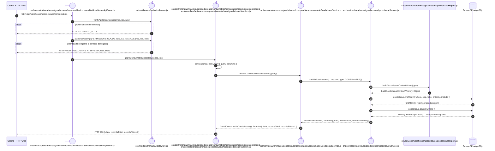

# `CU-SAL-15` — Consultar salidas de consumible

**Patrones:** `BE-P01`.

```mermaid
sequenceDiagram
    autonumber
    participant Client as Cliente HTTP / web
    participant Route@{ "type": "boundary" } as src/routes/api/warehouse/goodsIssues/consumables/consumableGoodsIssueApiRoute.js
    participant Auth@{ "type": "control" } as src/middleware/authMiddleware.js
    participant Controller@{ "type": "control" } as src/controllers/api/warehouse/goodsIssues/consumables/consumableGoodsIssueController.js<br/>src/controllers/api/warehouse/goodsIssues/shared/goodsIssueHandlers.js
    participant Facade@{ "type": "control" } as src/services/warehouse/goodsIssues/consumables/consumableGoodsIssueService.js
    participant Core@{ "type": "control" } as src/services/warehouse/goodsIssues/goodsIssueService.js
    participant Helpers as src/services/warehouse/goodsIssues/goodsIssueHelpers.js
    participant Prisma@{ "type": "database" } as Prisma / PostgreSQL

    Client->>Route: GET /api/warehouse/goods-issues/consumables
    Route->>Auth: verifyApiTokenRequired(req, res, next)
    break Token ausente o inválido
        Auth-->>Client: HTTP 401 INVALID_AUTH
    end
    Route->>Auth: authorizeUserApi(PERMISSIONS.GOODS_ISSUES_MANAGE)(req, res, next)
    break Identidad no vigente o permiso denegado
        Auth-->>Client: HTTP 401 INVALID_AUTH o HTTP 403 FORBIDDEN
    end
    Route->>Controller: getAllConsumableGoodsIssues(req, res)
    Controller->>Controller: getIssueDataTableQuery({ query, columns })
    Controller->>Facade: findAllConsumableGoodsIssues(query)
    Facade->>Core: findAllGoodsIssues({ ...options, type: CONSUMABLE })
    Core->>Helpers: buildGoodsIssueContextWhere(type)
    Helpers-->>Core: buildGoodsIssueContextWhere(): Object
    Core->>Prisma: goodsIssue.findMany({ where, skip, take, orderBy, include })
    Prisma-->>Core: findMany(): Promise[GoodsIssue[]]
    Core->>Prisma: goodsIssue.count({ where })
    Prisma-->>Core: count(): Promise[number] — total y filtered iguales
    Core-->>Facade: findAllGoodsIssues(): Promise[{ data, recordsTotal, recordsFiltered }]
    Facade-->>Controller: findAllConsumableGoodsIssues(): Promise[{ data, recordsTotal, recordsFiltered }]
    Controller-->>Client: HTTP 200 { data, recordsTotal, recordsFiltered }
```
