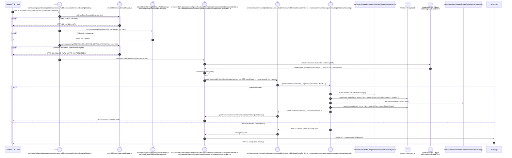

# `CU-SAL-17` — Editar encabezado de salida de consumible

**Patrones:** `BE-P01`, `BE-P04`.

```mermaid
sequenceDiagram
    autonumber
    participant Client as Cliente HTTP / web
    participant Route@{ "type": "boundary" } as src/routes/api/warehouse/goodsIssues/consumables/consumableGoodsIssueApiRoute.js
    participant Auth@{ "type": "control" } as src/middleware/authMiddleware.js
    participant Validator@{ "type": "control" } as src/validators/forms/goodsIssueValidations.js<br/>src/middleware/validatorMiddleware.js
    participant Controller@{ "type": "control" } as src/controllers/api/warehouse/goodsIssues/consumables/consumableGoodsIssueController.js<br/>src/controllers/api/warehouse/goodsIssues/shared/goodsIssueHandlers.js
    participant Facade@{ "type": "control" } as src/services/warehouse/goodsIssues/consumables/consumableGoodsIssueService.js
    participant Core@{ "type": "control" } as src/services/warehouse/goodsIssues/goodsIssueService.js
    participant Helpers as src/services/warehouse/goodsIssues/goodsIssueHelpers.js
    participant Prisma@{ "type": "database" } as Prisma / PostgreSQL
    participant DTO@{ "type": "entity" } as goodsIssueDto: Object<br/>src/dtos/goodsIssueDTO.js
    participant Header as src/services/warehouse/issues/issueHeaderService.js
    participant ErrorHandler as src/app.js

    Client->>Route: PATCH /api/warehouse/goods-issues/consumables/:id/header
    Route->>Auth: verifyApiTokenRequired(req, res, next)
    break Token ausente o inválido
        Auth-->>Client: HTTP 401 INVALID_AUTH
    end
    Route->>Validator: goodsIssueHeaderValidation[] y validate(req, res, next)
    break Validación rechazada
        Validator-->>Client: HTTP 400 { errors }
    end
    Route->>Auth: authorizeUserApi(PERMISSIONS.GOODS_ISSUES_MANAGE)(req, res, next)
    break Identidad no vigente o permiso denegado
        Auth-->>Client: HTTP 401 INVALID_AUTH o HTTP 403 FORBIDDEN
    end
    Route->>Controller: editConsumableGoodsIssueHeader(req, res)
    Controller->>DTO: createGoodsIssueHeaderDtoForEdit(req.body)
    DTO-->>Controller: createGoodsIssueHeaderDtoForEdit(): Object — DTO normalizado
    Controller->>Controller: sanitizeEmptyStrings(dto)
    Controller->>Facade: updateConsumableGoodsIssueHeader(options con DTO, identificadores y actor cuando corresponde)
    Facade->>Core: updateGoodsIssueHeader({ ...options, type: CONSUMABLE })
    alt Servicio resuelto
        Core->>Helpers: buildGoodsIssueContextWhere(type)
        Core->>Prisma: goodsIssue.findUnique({ where: { id, ...contextWhere }, include: estados y detalles })
        Core->>Header: resolveIssueHeaderData(options)
        Core->>Prisma: goodsIssue.update({ where: { id, ...contextWhere }, data: headerData })
        Core-->>Facade: updateGoodsIssueHeader(): Promise[GoodsIssue]
        Facade-->>Controller: updateConsumableGoodsIssueHeader(): Promise[GoodsIssue]
        Controller-->>Client: HTTP 200 { goodsIssue, code }
    else Error de dominio o persistencia
        Core-->>Facade: error — rollback si falló la transacción
        Facade-->>Controller: error propagado
        Controller->>ErrorHandler: next(error) — propagación de Express
        ErrorHandler-->>Client: HTTP de error { code, message }
    end
```
