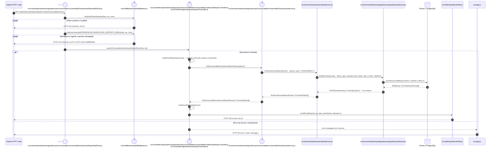

# `CU-SAL-21` — Generar reporte de salidas de consumible

**Patrones:** `BE-P07`.

```mermaid
sequenceDiagram
    autonumber
    participant Client as Cliente HTTP / web
    participant Route@{ "type": "boundary" } as src/routes/api/warehouse/goodsIssues/consumables/consumableGoodsIssueReportApiRoute.js
    participant Auth@{ "type": "control" } as src/middleware/authMiddleware.js
    participant Controller@{ "type": "control" } as src/controllers/api/warehouse/goodsIssues/consumables/consumableGoodsIssueReportController.js<br/>src/controllers/api/warehouse/reportController.js
    participant Facade@{ "type": "control" } as src/services/warehouse/goodsIssues/consumables/consumableGoodsIssueService.js
    participant Query as src/services/warehouse/reportService.js
    participant List as src/services/warehouse/goodsIssues/goodsIssueService.js
    participant Prisma@{ "type": "database" } as Prisma / PostgreSQL
    participant Excel as src/utils/reportExcelUtils.js
    participant ErrorHandler as src/app.js

    Client->>Route: GET /api/warehouse/reports/goods-issues/consumables/excel
    Route->>Auth: verifyApiTokenRequired(req, res, next)
    break Token ausente o inválido
        Auth-->>Client: HTTP 401 INVALID_AUTH
    end
    Route->>Auth: authorizeUserApi(PERMISSIONS.WAREHOUSE_REPORTS_READ)(req, res, next)
    break Identidad no vigente o permiso denegado
        Auth-->>Client: HTTP 401 INVALID_AUTH o HTTP 403 FORBIDDEN
    end
    Route->>Controller: exportConsumableGoodsIssueReportExcel(req, res)
    alt Exportación resuelta
        Controller->>Controller: buildIssueReportQuery(req) — periodo mensual cuando corresponde
        Controller->>Facade: findConsumableGoodsIssueReportRows(options)
        Facade->>Query: findGoodsIssueReportRows({ ...options, type: CONSUMABLE })
        Query->>List: findAllGoodsIssues({ ...filtros, type, includeCounts: false, skip: 0, take: 100000 })
        List->>Prisma: goodsIssue.findMany({ where: contexto y filtros })
        Prisma-->>List: findMany(): Promise[GoodsIssue[]]
        List-->>Query: findAllGoodsIssues(): Promise[{ data }] — sin conteos
        Query-->>Facade: findGoodsIssueReportRows(): Promise[Object[]]
        Facade-->>Controller: findConsumableGoodsIssueReportRows(): Promise[Object[]]
        Controller->>Controller: buildIssueReportData(rows)
        Controller->>Excel: sendExcelReport({ res, data, sheetName, filename })
        Excel-->>Client: HTTP 200 archivo XLSX
    else Error de lectura o exportación
        Controller-->>ErrorHandler: error propagado por Express
        ErrorHandler-->>Client: HTTP de error { code, message }
    end
```
