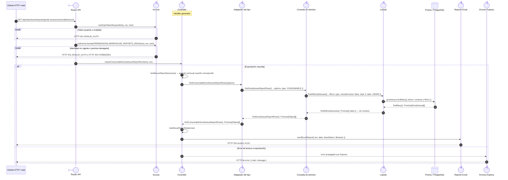

# `CU-SAL-21` — Generar reporte de salidas de consumible

**Patrones:** `BE-P07`.

## Participantes y trazabilidad

Cada línea de vida técnica corresponde a un único archivo de implementación, indicado
por su alias en la tabla. Dos archivos distintos usan participantes distintos. Los actores,
el navegador y la frontera de persistencia son elementos externos, no archivos del proyecto.
Los retornos representan el resultado o error de la función ejecutada en el archivo indicado.

| Alias | Rol visual | Archivo de implementación |
| --- | --- | --- |
| `Route` | boundary | [`consumableGoodsIssueReportApiRoute.js`](../../../../../../src/routes/api/warehouse/goodsIssues/consumables/consumableGoodsIssueReportApiRoute.js) |
| `Auth` | control | [`authMiddleware.js`](../../../../../../src/middleware/authMiddleware.js) |
| `Controller` | control | [`reportController.js`](../../../../../../src/controllers/api/warehouse/reportController.js) |
| `Facade` | control | [`consumableGoodsIssueService.js`](../../../../../../src/services/warehouse/goodsIssues/consumables/consumableGoodsIssueService.js) |
| `Query` | control | [`reportService.js`](../../../../../../src/services/warehouse/reportService.js) |
| `List` | control | [`goodsIssueService.js`](../../../../../../src/services/warehouse/goodsIssues/goodsIssueService.js) |
| `Excel` | control | [`reportExcelUtils.js`](../../../../../../src/utils/reportExcelUtils.js) |
| `ErrorHandler` | control | [`app.js`](../../../../../../src/app.js) |

### Configuración y archivos de contexto

El módulo específico configura y exporta el handler generado en el archivo de la línea `Controller`: [`consumableGoodsIssueReportController.js`](../../../../../../src/controllers/api/warehouse/goodsIssues/consumables/consumableGoodsIssueReportController.js).

## Secuencia de implementación

