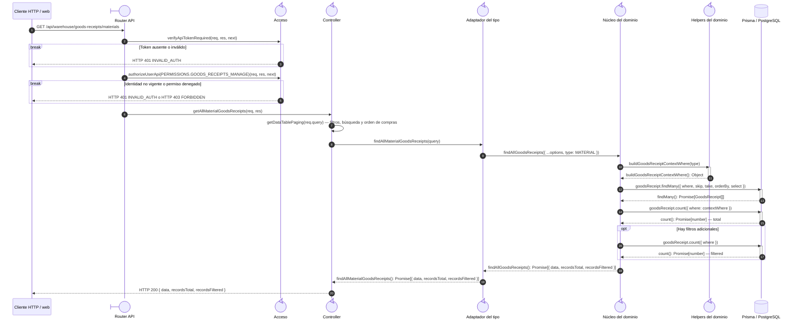

# `CU-ENT-01` — Consultar compras de material

**Patrones:** `BE-P01`.

## Participantes y trazabilidad

Los nombres breves del diagrama corresponden a los archivos vinculados siguientes.
La ruta completa se conserva en cada enlace, fuera de la cabecera visual. Un participante
puede agrupar colaboradores del mismo rol; esa agrupación no implica una clase ni un
proceso independiente. Los retornos representan el resultado o error propagado.

| Alias | Rol visual | Archivos de implementación |
| --- | --- | --- |
| `Route` | boundary | [`materialGoodsReceiptApiRoute.js`](../../../../../../src/routes/api/warehouse/goodsReceipts/materials/materialGoodsReceiptApiRoute.js) |
| `Auth` | control | [`authMiddleware.js`](../../../../../../src/middleware/authMiddleware.js) |
| `Controller` | control | [`materialGoodsReceiptController.js`](../../../../../../src/controllers/api/warehouse/goodsReceipts/materials/materialGoodsReceiptController.js) [`goodsReceiptHandlers.js`](../../../../../../src/controllers/api/warehouse/goodsReceipts/shared/goodsReceiptHandlers.js) |
| `Facade` | control | [`materialGoodsReceiptService.js`](../../../../../../src/services/warehouse/goodsReceipts/materials/materialGoodsReceiptService.js) |
| `Core` | control | [`goodsReceiptService.js`](../../../../../../src/services/warehouse/goodsReceipts/goodsReceiptService.js) |
| `Helpers` | control | [`goodsReceiptHelpers.js`](../../../../../../src/services/warehouse/goodsReceipts/goodsReceiptHelpers.js) |

## Secuencia de implementación

