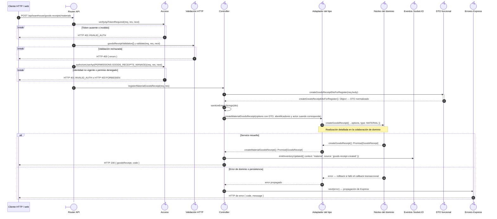
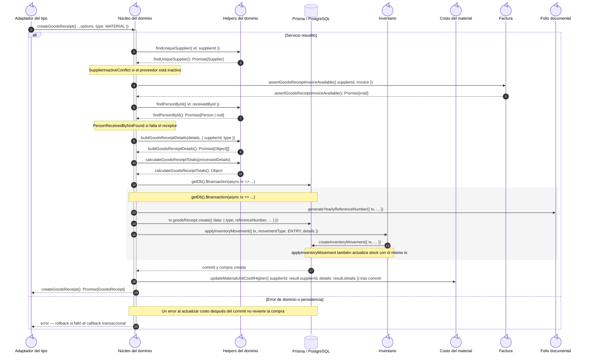

# `CU-ENT-02` — Crear compra de material

**Patrones:** `BE-P01`, `BE-P03`, `BE-P04`, `BE-P05`.

Si el selector crea un proveedor, antes de esta secuencia el navegador completa el `POST
/api/warehouse/suppliers` de [`CU-CAT-02`](../catalogs/cu-cat-02.md#cu-cat-02). La compra recibe el
`supplierId` resultante — el alta no se integra en la transacción de la compra ni habilita la ruta web
independiente de proveedores.

## Participantes y trazabilidad

Los nombres breves del diagrama corresponden a los archivos vinculados siguientes.
La ruta completa se conserva en cada enlace, fuera de la cabecera visual. Un participante
puede agrupar colaboradores del mismo rol; esa agrupación no implica una clase ni un
proceso independiente. Los retornos representan el resultado o error propagado.

| Alias | Rol visual | Archivos de implementación |
| --- | --- | --- |
| `Route` | boundary | [`materialGoodsReceiptApiRoute.js`](../../../../../../src/routes/api/warehouse/goodsReceipts/materials/materialGoodsReceiptApiRoute.js) |
| `Auth` | control | [`authMiddleware.js`](../../../../../../src/middleware/authMiddleware.js) |
| `Validator` | control | [`goodsReceiptValidations.js`](../../../../../../src/validators/forms/goodsReceiptValidations.js) [`validatorMiddleware.js`](../../../../../../src/middleware/validatorMiddleware.js) |
| `Controller` | control | [`materialGoodsReceiptController.js`](../../../../../../src/controllers/api/warehouse/goodsReceipts/materials/materialGoodsReceiptController.js) [`goodsReceiptHandlers.js`](../../../../../../src/controllers/api/warehouse/goodsReceipts/shared/goodsReceiptHandlers.js) |
| `Facade` | control | [`materialGoodsReceiptService.js`](../../../../../../src/services/warehouse/goodsReceipts/materials/materialGoodsReceiptService.js) |
| `Core` | control | [`goodsReceiptService.js`](../../../../../../src/services/warehouse/goodsReceipts/goodsReceiptService.js) |
| `Helpers` | control | [`goodsReceiptHelpers.js`](../../../../../../src/services/warehouse/goodsReceipts/goodsReceiptHelpers.js) [`supplierService.js`](../../../../../../src/services/warehouse/supplierService.js) [`personService.js`](../../../../../../src/services/admin/person/personService.js) |
| `Inventory` | control | [`movementService.js`](../../../../../../src/services/inventory/movementService.js) |
| `Socket` | control | [`socketUtils.js`](../../../../../../src/utils/socketUtils.js) |
| `DTO` | control | [`goodsReceiptDTO.js`](../../../../../../src/dtos/goodsReceiptDTO.js) |
| `ErrorHandler` | control | [`app.js`](../../../../../../src/app.js) |
| `Costs` | control | [`supplierMaterialService.js`](../../../../../../src/services/warehouse/materials/supplierMaterialService.js) |
| `Invoice` | control | [`goodsReceiptInvoiceService.js`](../../../../../../src/services/warehouse/goodsReceipts/goodsReceiptInvoiceService.js) |
| `Reference` | control | [`referenceNumberService.js`](../../../../../../src/services/document/referenceNumberService.js) |

## Secuencia de entrada y coordinación

El primer nivel conserva método, controles HTTP, normalización, adaptación del tipo,
respuesta y publicación. La llamada del adaptador al núcleo es la frontera que amplía
el segundo nivel; ambas figuras realizan el mismo caso, sin añadir otra operación.

## Colaboración interna del dominio

Este nivel amplía la invocación `Facade → Core` anterior. Conserva consultas, reglas,
helpers y contexto de persistencia. Su error retorna al adaptador y se propaga según
la primera figura; los mensajes se numeran de nuevo dentro de esta colaboración.

