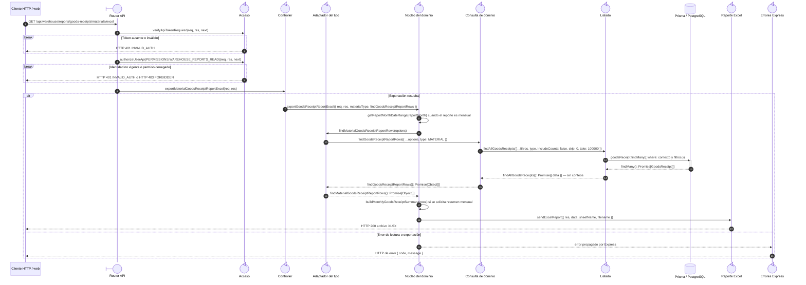

# `CU-ENT-06` — Generar reporte de compras de material

**Patrones:** `BE-P07`.

    opt Error de lectura o exportación
        Core-->>ErrorHandler: error propagado por Express
        ErrorHandler-->>Client: HTTP de error { code, message }
        end
    end
## Participantes y trazabilidad

Los nombres breves del diagrama corresponden a los archivos vinculados siguientes.
La ruta completa se conserva en cada enlace, fuera de la cabecera visual. Un participante
puede agrupar colaboradores del mismo rol; esa agrupación no implica una clase ni un
proceso independiente. Los retornos representan el resultado o error propagado.

| Alias | Rol visual | Archivos de implementación |
| --- | --- | --- |
| `Route` | boundary | [`materialGoodsReceiptReportApiRoute.js`](../../../../../../src/routes/api/warehouse/goodsReceipts/materials/materialGoodsReceiptReportApiRoute.js) |
| `Auth` | control | [`authMiddleware.js`](../../../../../../src/middleware/authMiddleware.js) |
| `Controller` | control | [`materialGoodsReceiptReportController.js`](../../../../../../src/controllers/api/warehouse/goodsReceipts/materials/materialGoodsReceiptReportController.js) |
| `Facade` | control | [`materialGoodsReceiptService.js`](../../../../../../src/services/warehouse/goodsReceipts/materials/materialGoodsReceiptService.js) |
| `Core` | control | [`reportController.js`](../../../../../../src/controllers/api/warehouse/reportController.js) |
| `Query` | control | [`reportService.js`](../../../../../../src/services/warehouse/reportService.js) |
| `List` | control | [`goodsReceiptService.js`](../../../../../../src/services/warehouse/goodsReceipts/goodsReceiptService.js) |
| `Excel` | control | [`reportExcelUtils.js`](../../../../../../src/utils/reportExcelUtils.js) |
| `ErrorHandler` | control | [`app.js`](../../../../../../src/app.js) |

## Secuencia de implementación

