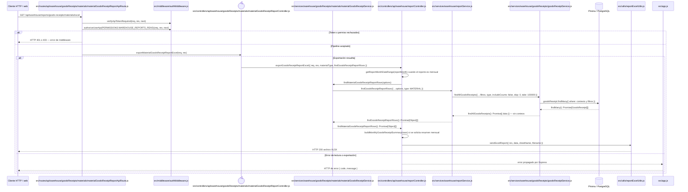

# `CU-ENT-06` — Generar reporte de compras de material

**Patrones:** `BE-P07`.

    opt Error de lectura o exportación
        Core-->>ErrorHandler: error propagado por Express
        ErrorHandler-->>Client: HTTP de error { code, message }
        end
    end

