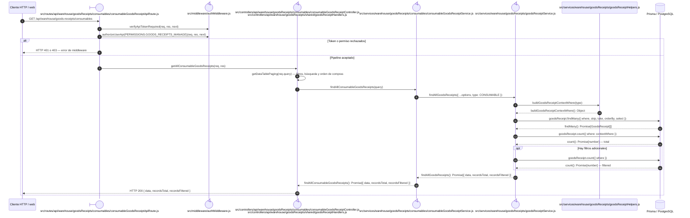

# `CU-ENT-07` — Consultar compras de consumible

**Patrones:** `BE-P01`.

```mermaid
sequenceDiagram
    autonumber
    participant Client as Cliente HTTP / web
    participant Route@{ "type": "boundary" } as src/routes/api/warehouse/goodsReceipts/consumables/consumableGoodsReceiptApiRoute.js
    participant Auth@{ "type": "control" } as src/middleware/authMiddleware.js
    participant Controller@{ "type": "control" } as src/controllers/api/warehouse/goodsReceipts/consumables/consumableGoodsReceiptController.js<br/>src/controllers/api/warehouse/goodsReceipts/shared/goodsReceiptHandlers.js
    participant Facade@{ "type": "control" } as src/services/warehouse/goodsReceipts/consumables/consumableGoodsReceiptService.js
    participant Core@{ "type": "control" } as src/services/warehouse/goodsReceipts/goodsReceiptService.js
    participant Helpers as src/services/warehouse/goodsReceipts/goodsReceiptHelpers.js
    participant Prisma@{ "type": "database" } as Prisma / PostgreSQL

    Client->>Route: GET /api/warehouse/goods-receipts/consumables
    Route->>Auth: verifyApiTokenRequired(req, res, next)
    Route->>Auth: authorizeUserApi(PERMISSIONS.GOODS_RECEIPTS_MANAGE)(req, res, next)
    alt Token o permiso rechazados
        Route-->>Client: HTTP 401 o 403 — error de middleware
    else Pipeline aceptado
        Route->>Controller: getAllConsumableGoodsReceipts(req, res)
        Controller->>Controller: getDataTablePaging(req.query) — filtros, búsqueda y orden de compras
        Controller->>Facade: findAllConsumableGoodsReceipts(query)
        Facade->>Core: findAllGoodsReceipts({ ...options, type: CONSUMABLE })
        Core->>Helpers: buildGoodsReceiptContextWhere(type)
        Helpers-->>Core: buildGoodsReceiptContextWhere(): Object
        Core->>Prisma: goodsReceipt.findMany({ where, skip, take, orderBy, select })
        Prisma-->>Core: findMany(): Promise[GoodsReceipt[]]
        Core->>Prisma: goodsReceipt.count({ where: contextWhere })
        Prisma-->>Core: count(): Promise[number] — total
        opt Hay filtros adicionales
            Core->>Prisma: goodsReceipt.count({ where })
            Prisma-->>Core: count(): Promise[number] — filtered
        end
        Core-->>Facade: findAllGoodsReceipts(): Promise[{ data, recordsTotal, recordsFiltered }]
        Facade-->>Controller: findAllConsumableGoodsReceipts(): Promise[{ data, recordsTotal, recordsFiltered }]
        Controller-->>Client: HTTP 200 { data, recordsTotal, recordsFiltered }
    end
```
