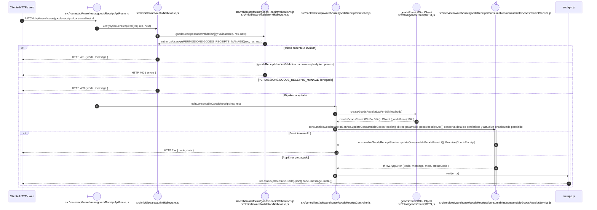

# `CU-ENT-09` — Editar compra de consumible

> Esta secuencia usa la ruta y la fachada específicas de consumibles; los componentes con nombres históricos de material pertenecen al núcleo compartido de inventario.

**Patrones:** `BE-P01`, `BE-P03`, `BE-P04`, `BE-P05`.

