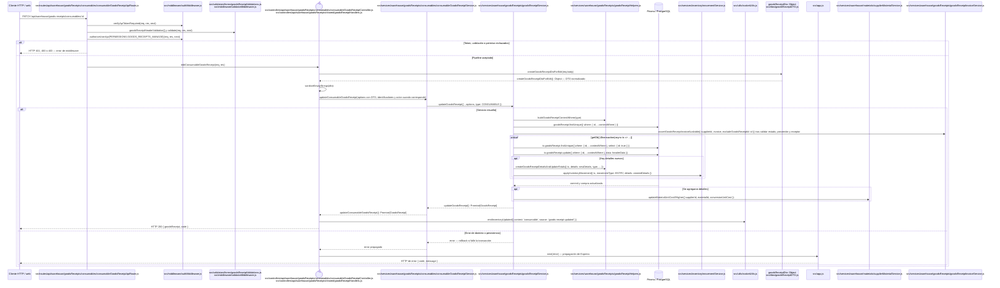

# `CU-ENT-09` — Editar compra de consumible

**Patrones:** `BE-P01`, `BE-P03`, `BE-P04`, `BE-P05`.

```mermaid
sequenceDiagram
    participant Client as Cliente HTTP / web
    participant Route as src/routes/api/warehouse/goodsReceipts/consumables/consumableGoodsReceiptApiRoute.js
    participant Auth as src/middleware/authMiddleware.js
    participant Validator as src/validators/forms/goodsReceiptValidations.js<br/>src/middleware/validatorMiddleware.js
    participant Controller@{ "type": "control" } as src/controllers/api/warehouse/goodsReceipts/consumables/consumableGoodsReceiptController.js<br/>src/controllers/api/warehouse/goodsReceipts/shared/goodsReceiptHandlers.js
    participant Facade as src/services/warehouse/goodsReceipts/consumables/consumableGoodsReceiptService.js
    participant Core as src/services/warehouse/goodsReceipts/goodsReceiptService.js
    participant Helpers as src/services/warehouse/goodsReceipts/goodsReceiptHelpers.js
    participant Prisma@{ "type": "database" } as Prisma / PostgreSQL
    participant Inventory as src/services/inventory/movementService.js
    participant Socket as src/utils/socketUtils.js
    participant DTO as goodsReceiptDto: Object<br/>src/dtos/goodsReceiptDTO.js
    participant ErrorHandler as src/app.js
    participant Costs as src/services/warehouse/materials/supplierMaterialService.js
    participant Invoice as src/services/warehouse/goodsReceipts/goodsReceiptInvoiceService.js

    Client->>Route: PATCH /api/warehouse/goods-receipts/consumables/:id
    Route->>Auth: verifyApiTokenRequired(req, res, next)
    Route->>Validator: goodsReceiptHeaderValidation[] y validate(req, res, next)
    Route->>Auth: authorizeUserApi(PERMISSIONS.GOODS_RECEIPTS_MANAGE)(req, res, next)
    alt Token, validación o permiso rechazados
        Route-->>Client: HTTP 401, 400 o 403 — error de middleware
    else Pipeline aceptado
        Route->>Controller: editConsumableGoodsReceipt(req, res)
        Controller->>DTO: createGoodsReceiptDtoForEdit(req.body)
        DTO-->>Controller: createGoodsReceiptDtoForEdit(): Object — DTO normalizado
        Controller->>Controller: sanitizeEmptyStrings(dto)
        Controller->>Facade: updateConsumableGoodsReceipt(options con DTO, identificadores y actor cuando corresponde)
        Facade->>Core: updateGoodsReceipt({ ...options, type: CONSUMABLE })
        alt Servicio resuelto
            Core->>Helpers: buildGoodsReceiptContextWhere(type)
            Core->>Prisma: goodsReceipt.findUnique({ where: { id, ...contextWhere } })
            Core->>Invoice: assertGoodsReceiptInvoiceAvailable({ supplierId, invoice, excludeGoodsReceiptId: id }) tras validar estado, proveedor y receptor
            critical getDb().$transaction(async tx => ...)
                Core->>Prisma: tx.goodsReceipt.findUnique({ where: { id, ...contextWhere }, select: { id: true } })
                Core->>Prisma: tx.goodsReceipt.update({ where: { id, ...contextWhere }, data: headerData })
                opt Hay detalles nuevos
                    Core->>Helpers: createGoodsReceiptDetailsAndUpdateTotals({ tx, details: newDetails, type, ... })
                    Core->>Inventory: applyInventoryMovement({ tx, movementType: ENTRY, details: createdDetails })
                end
            end
            Prisma-->>Core: commit y compra actualizada
            opt Se agregaron detalles
                Core->>Costs: updateMaterialUnitCostIfHigher({ supplierId, materialId, conversionUnitCost })
            end
            Core-->>Facade: updateGoodsReceipt(): Promise[GoodsReceipt]
            Facade-->>Controller: updateConsumableGoodsReceipt(): Promise[GoodsReceipt]
            Controller->>Socket: emitInventoryUpdated({ context: 'consumable', source: 'goods-receipt-updated' })
            Controller-->>Client: HTTP 200 { goodsReceipt, code }
        else Error de dominio o persistencia
            Core-->>Facade: error — rollback si falló la transacción
            Facade-->>Controller: error propagado
            Controller->>ErrorHandler: next(error) — propagación de Express
            ErrorHandler-->>Client: HTTP de error { code, message }
        end
    end
```
