# `CU-ENT-10` — Corregir consumible de una compra

> Esta secuencia usa la ruta y la fachada específicas de consumibles; los componentes con nombres históricos de material pertenecen al núcleo compartido de inventario.

**Patrones:** `BE-P01`, `BE-P03`, `BE-P04`, `BE-P05`.

```mermaid
sequenceDiagram
    autonumber
    participant Client as Cliente HTTP / web
    participant Router@{ "type": "boundary" } as src/routes/api/warehouse/goodsReceiptApiRoute.js
    participant Auth@{ "type": "control" } as src/middleware/authMiddleware.js
    participant Validator@{ "type": "control" } as src/validators/forms/goodsReceiptValidations.js<br/>src/middleware/validatorMiddleware.js
    participant Controller@{ "type": "control" } as src/controllers/api/warehouse/goodsReceiptController.js
    participant CorrectionDto@{ "type": "entity" } as correctionDto: Object<br/>src/dtos/goodsReceiptDTO.js
    participant Service@{ "type": "control" } as src/services/warehouse/goodsReceipts/consumables/consumableGoodsReceiptService.js
    participant Change@{ "type": "control" } as src/services/warehouse/goodsReceipts/detailChanges/goodsReceiptDetailChangeService.js
    participant Reason@{ "type": "control" } as src/services/warehouse/reasonService.js
    participant Inventory@{ "type": "control" } as src/services/inventory/movementService.js
    participant Prisma@{ "type": "database" } as Prisma / PostgreSQL
    participant Socket as src/utils/socketUtils.js

    Client->>Router: PATCH /api/warehouse/goods-receipts/consumables/:id/details/:detailId/corrections + accessToken
    Router->>Auth: verifyApiTokenRequired(req, res, next)
    Auth->>Validator: goodsReceiptCorrectionValidation[] y validate(req, res, next)
    Validator->>Auth: authorizeUserApi(PERMISSIONS.GOODS_RECEIPTS_MANAGE)(req, res, next)
    alt Token ausente o inválido
        Auth-->>Client: HTTP 401 { code, message }
    else goodsReceiptCorrectionValidation rechaza req.body/req.params
        Validator-->>Client: HTTP 400 { errors }
    else PERMISSIONS.GOODS_RECEIPTS_MANAGE denegado
        Auth-->>Client: HTTP 403 { code, message }
    else Pipeline aceptado
        Router->>Controller: correctGoodsReceiptDetail(req, res)
        Controller->>CorrectionDto: createGoodsReceiptDtoForCorrection(req.body)
        CorrectionDto-->>Controller: createGoodsReceiptDtoForCorrection(): Object (correctionDto)
        Controller->>Service: correctConsumableGoodsReceiptDetailLine({ id, detailId, correctionDto, userId })
        Service->>Prisma: getDb().$transaction(async tx => ...)
        Service->>Change: findReceiptDetailForChange({ tx, goodsReceiptId, detailId })
        Service->>Reason: findGoodsReceiptDetailChangeReason({ changeType, tx })
        Service->>Change: correctGoodsReceiptDetailAndTotals({ tx, goodsReceiptId, detailId, correctedDetail })
        Change->>Inventory: createGoodsReceiptDetailChangeMovementAndUpdateStock({ tx, detail, quantityDifference })
        Service->>Change: createGoodsReceiptDetailChange({ tx, previousDetail, correctedDetail, userId })
        alt Commit confirmado
            Prisma-->>Service: $transaction(): Promise[{ goodsReceipt: GoodsReceipt, correction: GoodsReceiptCorrection }]
            Service-->>Controller: correctConsumableGoodsReceiptDetailLine(): Promise[{ goodsReceipt: GoodsReceipt, correction: GoodsReceiptCorrection }]
            Controller->>Socket: emitInventoryUpdated()
            Controller-->>Client: 200 { goodsReceipt, correction, code }
        else Detalle, motivo o persistencia rechazados
            Prisma-->>Service: error de dominio o persistencia
            Service-->>Controller: error tipado y rollback
            Controller-->>Client: status HTTP { code, message }
        end
    end
```

