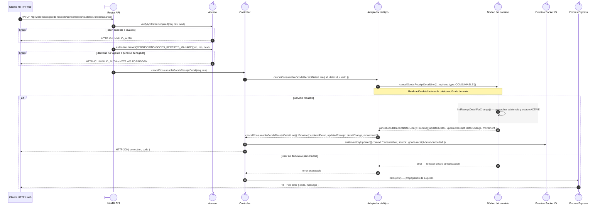
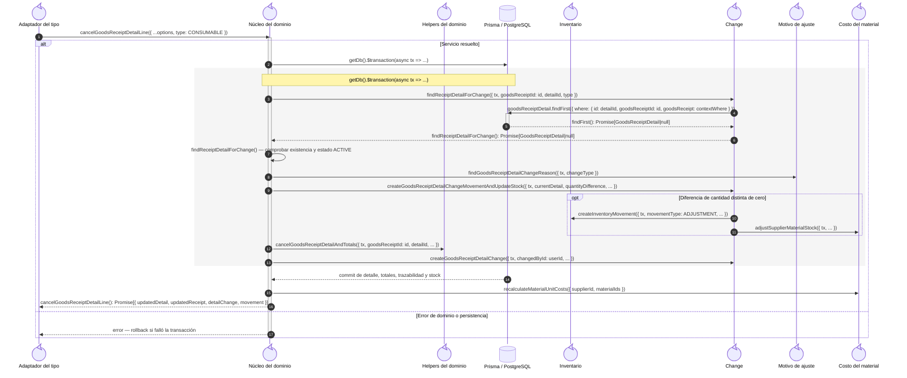

# `CU-ENT-11` — Cancelar consumible de una compra

**Patrones:** `BE-P01`, `BE-P03`, `BE-P04`, `BE-P05`.

## Participantes y trazabilidad

Los nombres breves del diagrama corresponden a los archivos vinculados siguientes.
La ruta completa se conserva en cada enlace, fuera de la cabecera visual. Un participante
puede agrupar colaboradores del mismo rol; esa agrupación no implica una clase ni un
proceso independiente. Los retornos representan el resultado o error propagado.

| Alias | Rol visual | Archivos de implementación |
| --- | --- | --- |
| `Route` | boundary | [`consumableGoodsReceiptApiRoute.js`](../../../../../../src/routes/api/warehouse/goodsReceipts/consumables/consumableGoodsReceiptApiRoute.js) |
| `Auth` | control | [`authMiddleware.js`](../../../../../../src/middleware/authMiddleware.js) |
| `Controller` | control | [`consumableGoodsReceiptController.js`](../../../../../../src/controllers/api/warehouse/goodsReceipts/consumables/consumableGoodsReceiptController.js) [`goodsReceiptHandlers.js`](../../../../../../src/controllers/api/warehouse/goodsReceipts/shared/goodsReceiptHandlers.js) |
| `Facade` | control | [`consumableGoodsReceiptService.js`](../../../../../../src/services/warehouse/goodsReceipts/consumables/consumableGoodsReceiptService.js) |
| `Core` | control | [`goodsReceiptCancellationService.js`](../../../../../../src/services/warehouse/goodsReceipts/detailChanges/goodsReceiptCancellationService.js) |
| `Helpers` | control | [`goodsReceiptHelpers.js`](../../../../../../src/services/warehouse/goodsReceipts/goodsReceiptHelpers.js) |
| `Inventory` | control | [`movementService.js`](../../../../../../src/services/inventory/movementService.js) |
| `Socket` | control | [`socketUtils.js`](../../../../../../src/utils/socketUtils.js) |
| `Change` | control | [`goodsReceiptDetailChangeService.js`](../../../../../../src/services/warehouse/goodsReceipts/detailChanges/goodsReceiptDetailChangeService.js) |
| `Reason` | control | [`reasonService.js`](../../../../../../src/services/warehouse/reasonService.js) |
| `Costs` | control | [`supplierMaterialService.js`](../../../../../../src/services/warehouse/materials/supplierMaterialService.js) |
| `ErrorHandler` | control | [`app.js`](../../../../../../src/app.js) |

## Secuencia de entrada y coordinación

El primer nivel conserva método, controles HTTP, normalización, adaptación del tipo,
respuesta y publicación. La llamada del adaptador al núcleo es la frontera que amplía
el segundo nivel; ambas figuras realizan el mismo caso, sin añadir otra operación.

## Colaboración interna del dominio

Este nivel amplía la invocación `Facade → Core` anterior. Conserva consultas, reglas,
helpers y contexto de persistencia. Su error retorna al adaptador y se propaga según
la primera figura; los mensajes se numeran de nuevo dentro de esta colaboración.

