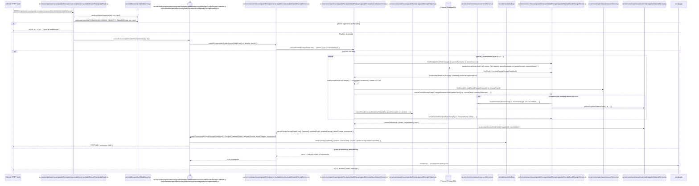

# `CU-ENT-11` — Cancelar consumible de una compra

**Patrones:** `BE-P01`, `BE-P03`, `BE-P04`, `BE-P05`.

```mermaid
sequenceDiagram
    participant Client as Cliente HTTP / web
    participant Route as src/routes/api/warehouse/goodsReceipts/consumables/consumableGoodsReceiptApiRoute.js
    participant Auth as src/middleware/authMiddleware.js
    participant Controller@{ "type": "control" } as src/controllers/api/warehouse/goodsReceipts/consumables/consumableGoodsReceiptController.js<br/>src/controllers/api/warehouse/goodsReceipts/shared/goodsReceiptHandlers.js
    participant Facade as src/services/warehouse/goodsReceipts/consumables/consumableGoodsReceiptService.js
    participant Core as src/services/warehouse/goodsReceipts/detailChanges/goodsReceiptCancellationService.js
    participant Helpers as src/services/warehouse/goodsReceipts/goodsReceiptHelpers.js
    participant Prisma@{ "type": "database" } as Prisma / PostgreSQL
    participant Inventory as src/services/inventory/movementService.js
    participant Socket as src/utils/socketUtils.js
    participant Change as src/services/warehouse/goodsReceipts/detailChanges/goodsReceiptDetailChangeService.js
    participant Reason as src/services/warehouse/reasonService.js
    participant Costs as src/services/warehouse/materials/supplierMaterialService.js
    participant ErrorHandler as src/app.js

    Client->>Route: PATCH /api/warehouse/goods-receipts/consumables/:id/details/:detailId/cancel
    Route->>Auth: verifyApiTokenRequired(req, res, next)
    Route->>Auth: authorizeUserApi(PERMISSIONS.GOODS_RECEIPTS_MANAGE)(req, res, next)
    alt Token o permiso rechazados
        Route-->>Client: HTTP 401 o 403 — error de middleware
    else Pipeline aceptado
        Route->>Controller: cancelConsumableGoodsReceiptDetail(req, res)
        Controller->>Facade: cancelConsumableGoodsReceiptDetailLine({ id, detailId, userId })
        Facade->>Core: cancelGoodsReceiptDetailLine({ ...options, type: CONSUMABLE })
        alt Servicio resuelto
            critical getDb().$transaction(async tx => ...)
                Core->>Change: findReceiptDetailForChange({ tx, goodsReceiptId: id, detailId, type })
                Change->>Prisma: goodsReceiptDetail.findFirst({ where: { id: detailId, goodsReceiptId: id, goodsReceipt: contextWhere } })
                Prisma-->>Change: findFirst(): Promise[GoodsReceiptDetail|null]
                Change-->>Core: findReceiptDetailForChange(): Promise[GoodsReceiptDetail|null]
                Core->>Core: findReceiptDetailForChange() — comprobar existencia y estado ACTIVE
                Core->>Reason: findGoodsReceiptDetailChangeReason({ tx, changeType })
                Core->>Change: createGoodsReceiptDetailChangeMovementAndUpdateStock({ tx, currentDetail, quantityDifference, ... })
                opt Diferencia de cantidad distinta de cero
                    Change->>Inventory: createInventoryMovement({ tx, movementType: ADJUSTMENT, ... })
                    Change->>Costs: adjustSupplierMaterialStock({ tx, ... })
                end
                Core->>Helpers: cancelGoodsReceiptDetailAndTotals({ tx, goodsReceiptId: id, detailId, ... })
                Core->>Change: createGoodsReceiptDetailChange({ tx, changedById: userId, ... })
            end
            Prisma-->>Core: commit de detalle, totales, trazabilidad y stock
            Core->>Costs: recalculateMaterialUnitCosts({ supplierId, materialIds })
            Core-->>Facade: cancelGoodsReceiptDetailLine(): Promise[{ updatedDetail, updatedReceipt, detailChange, movement }]
            Facade-->>Controller: cancelConsumableGoodsReceiptDetailLine(): Promise[{ updatedDetail, updatedReceipt, detailChange, movement }]
            Controller->>Socket: emitInventoryUpdated({ context: 'consumable', source: 'goods-receipt-detail-cancelled' })
            Controller-->>Client: HTTP 200 { correction, code }
        else Error de dominio o persistencia
            Core-->>Facade: error — rollback si falló la transacción
            Facade-->>Controller: error propagado
            Controller->>ErrorHandler: next(error) — propagación de Express
            ErrorHandler-->>Client: HTTP de error { code, message }
        end
    end
```
