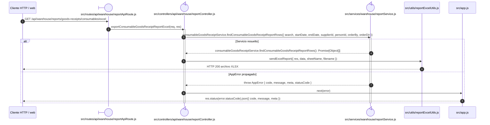

# `CU-ENT-12` — Generar reporte de compras de consumible

> Esta secuencia usa la ruta y la fachada específicas de consumibles; los componentes con nombres históricos de material pertenecen al núcleo compartido de inventario.

**Patrones:** `BE-P07`.

