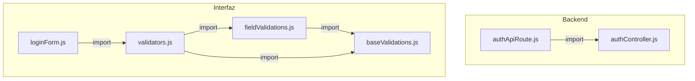
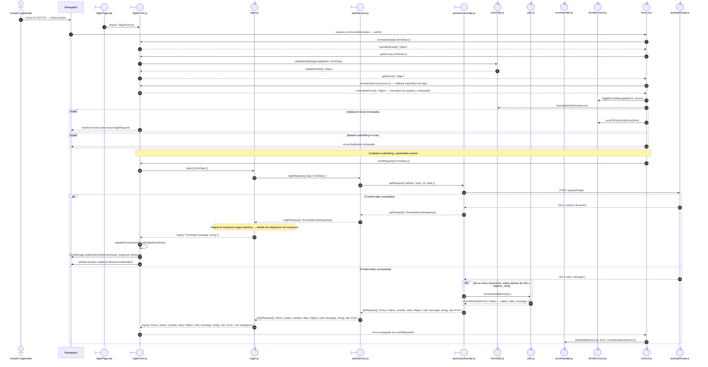
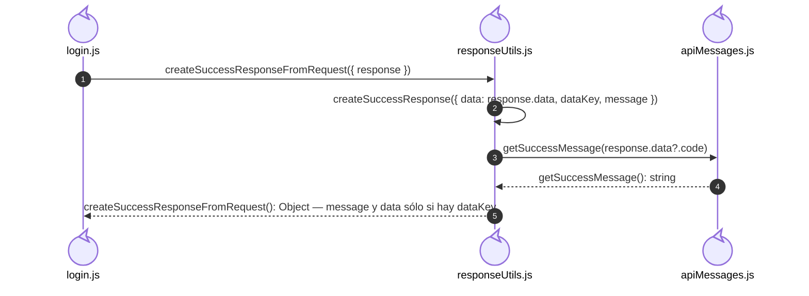

# `CU-AUT-01` — Iniciar sesión

**Patrones:** `FE-P01`, `FE-P09`.

## Participantes y trazabilidad

Cada línea de vida técnica corresponde a un único archivo de implementación, indicado
por su alias en la tabla. Dos archivos distintos usan participantes distintos. Los actores,
el navegador y la frontera de persistencia son elementos externos, no archivos del proyecto.
Los retornos representan el resultado o error de la función ejecutada en el archivo indicado.
La composición incluye también los archivos de configuración, construcción y reexport: cada
uno tiene un nodo propio, aunque no ejecute una delegación durante la petición.

| Alias | Rol visual | Archivo de implementación |
| --- | --- | --- |
| `EJS` | boundary | [`loginPage.ejs`](../../../../../../src/views/pages/home/login/loginPage.ejs) |
| `Form` | boundary | [`loginForm.js`](../../../../../../src/public/js/pages/home/login/loginForm.js) |
| `App` | control | [`login.js`](../../../../../../src/public/js/application/auth/login.js) |
| `Request` | boundary | [`authService.js`](../../../../../../src/public/js/services/authService.js) |
| `HTTP` | boundary | [`axiosInstanceApi.js`](../../../../../../src/public/js/services/axiosInstanceApi.js) |
| `API` | control | [`authController.js`](../../../../../../src/controllers/api/authController.js) |
| `FormUtils` | control | [`formUtils.js`](../../../../../../src/public/js/utils/formUtils.js) |
| `FileUtils` | control | [`utils.js`](../../../../../../src/public/js/api/utils.js) |
| `FileValidators` | control | [`validators.js`](../../../../../../src/public/js/utils/validations/validators.js) |
| `FileFieldValidations` | control | [`fieldValidations.js`](../../../../../../src/public/js/utils/validations/fieldValidations.js) |
| `FileBaseValidations` | control | [`baseValidations.js`](../../../../../../src/public/js/utils/validations/baseValidations.js) |
| `FormCore` | control | [`formUI.js`](../../../../../../src/public/js/ui/forms/formUI.js) |
| `FileFormErrorsUI` | control | [`formErrorsUI.js`](../../../../../../src/public/js/ui/forms/formErrorsUI.js) |
| `FileErrorHandler` | control | [`errorHandler.js`](../../../../../../src/public/js/api/errorHandler.js) |
| `FileResponseUtils` | control | [`responseUtils.js`](../../../../../../src/public/js/utils/responseUtils.js) |
| `FileApiMessages` | control | [`apiMessages.js`](../../../../../../src/public/js/constants/apiMessages.js) |
| `Transport` | control | [`authApiRoute.js`](../../../../../../src/routes/api/authApiRoute.js) |

## Composición de archivos

Los archivos que construyen, configuran o reexportan funciones aparecen como componentes
individuales. Las flechas representan imports reales, resueltos al cargar los módulos;
las llamadas durante la operación se muestran en las secuencias siguientes. Cada nombre
identifica un archivo y la tabla conserva su ruta completa.

## Secuencia de implementación

## Detalle de adaptación de respuesta

Amplía la adaptación posterior al request exitoso. El wrapper y la construcción de la
respuesta se ejecutan en `responseUtils.js`; el mensaje se obtiene de `apiMessages.js`.

