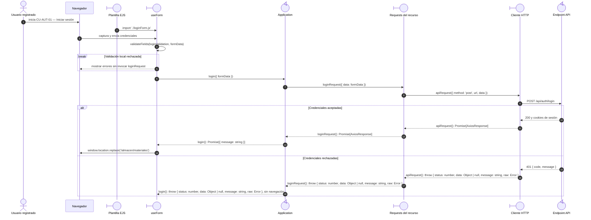

# `CU-AUT-01` — Iniciar sesión

**Patrones:** `FE-P01`, `FE-P09`.

## Participantes y trazabilidad

Los nombres breves del diagrama corresponden a los archivos vinculados siguientes.
La ruta completa se conserva en cada enlace, fuera de la cabecera visual. Un participante
puede agrupar colaboradores del mismo rol; esa agrupación no implica una clase ni un
proceso independiente. Los retornos representan el resultado o error propagado.

| Alias | Rol visual | Archivos de implementación |
| --- | --- | --- |
| `EJS` | boundary | [`loginPage.ejs`](../../../../../../src/views/pages/home/login/loginPage.ejs) |
| `Form` | boundary | [`loginForm.js`](../../../../../../src/public/js/pages/home/login/loginForm.js) |
| `App` | control | [`login.js`](../../../../../../src/public/js/application/auth/login.js) |
| `Request` | boundary | [`authService.js`](../../../../../../src/public/js/services/authService.js) |
| `HTTP` | boundary | [`axiosInstanceApi.js`](../../../../../../src/public/js/services/axiosInstanceApi.js) |
| `API` | control | [`authController.js`](../../../../../../src/controllers/api/authController.js) |

## Secuencia de implementación

