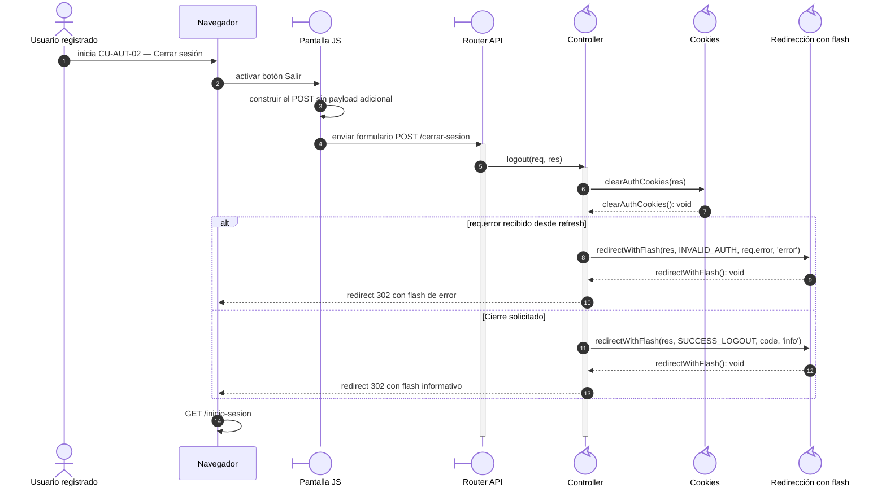

# `CU-AUT-02` — Cerrar sesión

**Patrones:** `FE-P09`.

## Participantes y trazabilidad

Cada línea de vida técnica corresponde a un único archivo de implementación, indicado
por su alias en la tabla. Dos archivos distintos usan participantes distintos. Los actores,
el navegador y la frontera de persistencia son elementos externos, no archivos del proyecto.
Los retornos representan el resultado o error de la función ejecutada en el archivo indicado.

| Alias | Rol visual | Archivo de implementación |
| --- | --- | --- |
| `View` | boundary | [`logoutForm.ejs`](../../../../../../src/views/layout/ui/logoutForm.ejs) |
| `Route` | boundary | [`logoutWebRoute.js`](../../../../../../src/routes/web/auth/logoutWebRoute.js) |
| `Controller` | control | [`authController.js`](../../../../../../src/controllers/web/authController.js) |
| `Cookies` | control | [`cookiesUtils.js`](../../../../../../src/utils/cookiesUtils.js) |
| `Flash` | control | [`flashUtils.js`](../../../../../../src/utils/flashUtils.js) |

## Secuencia de implementación

