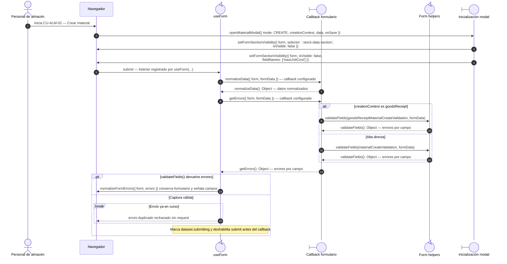
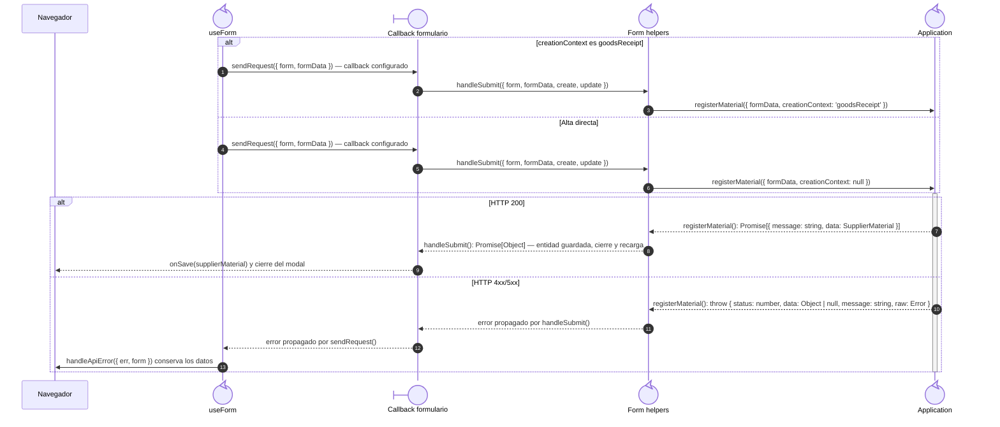
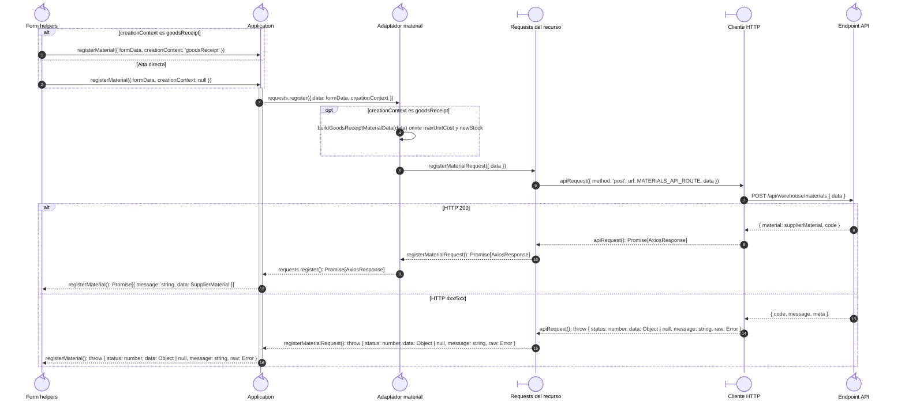

# `CU-ALM-02` — Crear material

**Patrones:** `FE-P02`.

## Participantes y trazabilidad

Cada línea de vida técnica corresponde a un único archivo de implementación, indicado
por su alias en la tabla. Dos archivos distintos usan participantes distintos. Los actores,
el navegador y la frontera de persistencia son elementos externos, no archivos del proyecto.
Los retornos representan el resultado o error de la función ejecutada en el archivo indicado.

| Alias | Rol visual | Archivo de implementación |
| --- | --- | --- |
| `View` | boundary | [`materialForm.js`](../../../../../../src/public/js/pages/warehouse/materials/materialForm.js) |
| `Application` | control | [`createCrudApplication.js`](../../../../../../src/public/js/application/createCrudApplication.js) |
| `Request` | boundary | [`materialService.js`](../../../../../../src/public/js/services/warehouse/materialService.js) |
| `HTTP` | boundary | [`axiosInstanceApi.js`](../../../../../../src/public/js/services/axiosInstanceApi.js) |
| `Transport` | control | [`materialApiRoute.js`](../../../../../../src/routes/api/warehouse/materialApiRoute.js) |
| `Modal` | boundary | [`materialModal.js`](../../../../../../src/public/js/pages/warehouse/materials/materialModal.js) |
| `FormUtils` | control | [`formUtils.js`](../../../../../../src/public/js/utils/formUtils.js) |
| `Form` | control | [`formUI.js`](../../../../../../src/public/js/ui/forms/formUI.js) |
| `MaterialAdapter` | control | [`materials.js`](../../../../../../src/public/js/application/warehouse/materials/materials.js) |

### Configuración y archivos de contexto

El endpoint queda representado por su router. El controller asociado se desarrolla en la [secuencia backend `CU-ALM-02`](../../backend-code-sequences/catalogs/cu-alm-02.md#cu-alm-02): [`materialController.js`](../../../../../../src/controllers/api/warehouse/materialController.js).

La línea `Application` ejecuta la función generada en `createCrudApplication.js`. Su nombre público y la configuración de requests/contratos provienen de [`materials.js`](../../../../../../src/public/js/application/warehouse/materials/materials.js); exportar esa función no crea otra llamada durante cada petición.

## Coordinación de la interfaz

Este nivel muestra apertura, normalización, validación y control de doble envío. Con
los datos válidos y `submitting` establecido, el listener continúa en `sendRequest`,
detallado en la figura siguiente. La rama inválida termina sin solicitar una mutación.

## Envío y resultado de la interfaz

Continúa el submit que superó la validación del nivel anterior. El callback del formulario
invoca la aplicación; su request se amplía en la colaboración de transporte. Aquí se
conservan los archivos que actualizan la interfaz o propagan el error al listener.

## Colaboración de aplicación y transporte

Amplía la llamada a `Application` del nivel anterior: cada request y el cliente HTTP tienen su propio archivo. El router identifica el endpoint de destino; su ejecución interna está en la secuencia backend del mismo CU. Los resultados regresan al caller de la primera figura.

