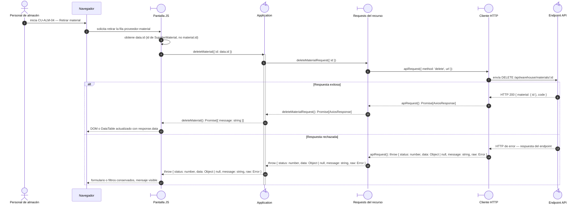

# `CU-ALM-04` — Retirar material

**Patrones:** `FE-P02`.

## Participantes y trazabilidad

Cada línea de vida técnica corresponde a un único archivo de implementación, indicado
por su alias en la tabla. Dos archivos distintos usan participantes distintos. Los actores,
el navegador y la frontera de persistencia son elementos externos, no archivos del proyecto.
Los retornos representan el resultado o error de la función ejecutada en el archivo indicado.

| Alias | Rol visual | Archivo de implementación |
| --- | --- | --- |
| `View` | boundary | [`materialDatatable.js`](../../../../../../src/public/js/plugins/datatable/warehouse/materials/materialDatatable.js) |
| `Application` | control | [`createCrudApplication.js`](../../../../../../src/public/js/application/createCrudApplication.js) |
| `Request` | boundary | [`materialService.js`](../../../../../../src/public/js/services/warehouse/materialService.js) |
| `HTTP` | boundary | [`axiosInstanceApi.js`](../../../../../../src/public/js/services/axiosInstanceApi.js) |
| `Transport` | control | [`materialApiRoute.js`](../../../../../../src/routes/api/warehouse/materialApiRoute.js) |

### Configuración y archivos de contexto

El endpoint queda representado por su router. El controller asociado se desarrolla en la [secuencia backend `CU-ALM-04`](../../backend-code-sequences/catalogs/cu-alm-04.md#cu-alm-04): [`materialController.js`](../../../../../../src/controllers/api/warehouse/materialController.js).

La línea `Application` ejecuta la función generada en `createCrudApplication.js`. Su nombre público y la configuración de requests/contratos provienen de [`materials.js`](../../../../../../src/public/js/application/warehouse/materials/materials.js); exportar esa función no crea otra llamada durante cada petición.

## Secuencia de implementación

