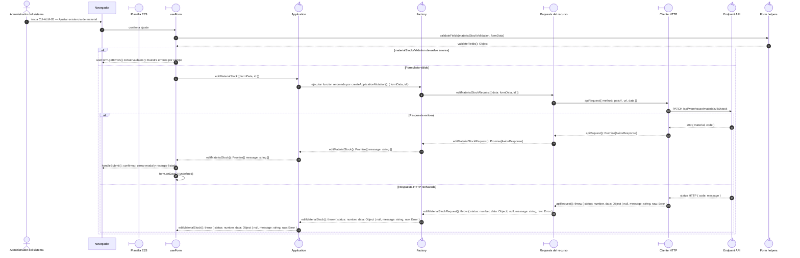

# `CU-ALM-05` — Ajustar existencia de material

**Patrones:** `FE-P02`.

## Participantes y trazabilidad

Cada línea de vida técnica corresponde a un único archivo de implementación, indicado
por su alias en la tabla. Dos archivos distintos usan participantes distintos. Los actores,
el navegador y la frontera de persistencia son elementos externos, no archivos del proyecto.
Los retornos representan el resultado o error de la función ejecutada en el archivo indicado.

| Alias | Rol visual | Archivo de implementación |
| --- | --- | --- |
| `EJS` | boundary | [`materialsPage.ejs`](../../../../../../src/views/pages/warehouse/materials/materialsPage.ejs) |
| `Form` | boundary | [`materialForm.js`](../../../../../../src/public/js/pages/warehouse/materials/materialForm.js) |
| `App` | control | [`materials.js`](../../../../../../src/public/js/application/warehouse/materials/materials.js) |
| `Factory` | control | [`createCrudApplication.js`](../../../../../../src/public/js/application/createCrudApplication.js) |
| `Request` | boundary | [`materialService.js`](../../../../../../src/public/js/services/warehouse/materialService.js) |
| `HTTP` | boundary | [`axiosInstanceApi.js`](../../../../../../src/public/js/services/axiosInstanceApi.js) |
| `API` | control | [`materialController.js`](../../../../../../src/controllers/api/warehouse/materialController.js) |
| `FormUtils` | control | [`formUtils.js`](../../../../../../src/public/js/utils/formUtils.js) |

## Secuencia de implementación

