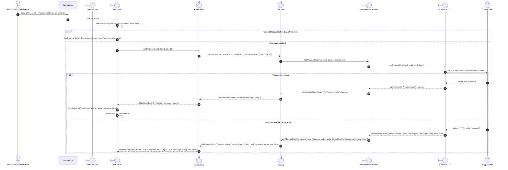

# `CU-ALM-05` — Ajustar existencia de material

**Patrones:** `FE-P02`.

## Participantes y trazabilidad

Los nombres breves del diagrama corresponden a los archivos vinculados siguientes.
La ruta completa se conserva en cada enlace, fuera de la cabecera visual. Un participante
puede agrupar colaboradores del mismo rol; esa agrupación no implica una clase ni un
proceso independiente. Los retornos representan el resultado o error propagado.

| Alias | Rol visual | Archivos de implementación |
| --- | --- | --- |
| `EJS` | boundary | [`materialsPage.ejs`](../../../../../../src/views/pages/warehouse/materials/materialsPage.ejs) |
| `Form` | boundary | [`materialForm.js`](../../../../../../src/public/js/pages/warehouse/materials/materialForm.js) |
| `App` | control | [`materials.js`](../../../../../../src/public/js/application/warehouse/materials/materials.js) |
| `Factory` | control | [`createCrudApplication.js`](../../../../../../src/public/js/application/createCrudApplication.js) |
| `Request` | boundary | [`materialService.js`](../../../../../../src/public/js/services/warehouse/materialService.js) |
| `HTTP` | boundary | [`axiosInstanceApi.js`](../../../../../../src/public/js/services/axiosInstanceApi.js) |
| `API` | control | [`materialController.js`](../../../../../../src/controllers/api/warehouse/materialController.js) |

## Secuencia de implementación

